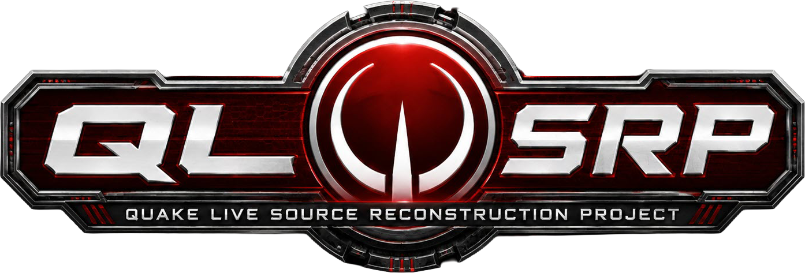

  

Quake Live SRP is the **Quake Live Source Reconstruction Project**.

The project rebuilds Quake Live engine and game source from the public Quake III Arena GPL source release, using the retail Quake Live binaries, Binary Ninja HLIL dumps, Ghidra exports, symbol maps, and runtime validation as evidence. The goal is faithful reconstruction of the retail codebase, not a loose remake or gameplay approximation.

## Current Status

Quake Live SRP is usable for reconstruction and compatibility testing, but it is still an active reverse-engineering project. The strict Windows retail-replacement target is currently audited as green; the whole repository remains slightly lower because compatibility-only, packaging, online-service, and evidence-freshness lanes are tracked honestly instead of hidden.

### At a glance

| Capability | Status | Answer | Notes |
| --- | --- | --- | --- |
| Everything loads | 🟢 Green | Yes | Engine, UI, assets, and module-loading paths reach the expected validation checkpoints when a legitimate Quake Live install is available. |
| Can connect to retail QL servers | 🔴 Red | No | Live Quake Live backend/auth services are not reconstructed. Online services stay behind `QL_BUILD_ONLINE_SERVICES`; source/Debug defaults stay disabled, while Windows Release builds opt into the compatibility lane. |
| Can load retail game modules | 🟢 Green | Yes | Retail `ui`, `cgamex86.dll`, and `qagamex86.dll` load in the current validation probes. |
| Retail clients can connect to SRP servers | 🟢 Green | Yes | SRP servers support retail clients in the validated server path, including the LAN auth fallback. Public service publication is a separate online-services concern. |
| Bot support | 🟡 Yellow | Partial | Botlib and server-game bot paths are present, but broader bot behavior, AAS, parser, movement, and combat parity are still under reconstruction. |
| Builds from source | 🟢 Green | Yes | Windows native builds are the primary path; Linux currently supports the 32-bit server game module lane. |
| Requires retail assets | 🟡 Yellow | Yes | A legitimate Quake Live installation is still required for retail data, media, and validation assets. |
| Strict Windows replacement target | 🟢 Green | 100% audited | The current audit treats the strict retail Windows target as closed on the current worktree. |
| Whole repository parity | 🟡 Yellow | 99% estimated | The remaining gap is mostly compatibility scope, packaging boundaries, online services, and validation freshness. |

### Engine compatibility

| Area | Status | Notes |
| --- | --- | --- |
| WebUI | 🟢 Implemented | Browser/UI bridge, runtime package comparison, and server-browser event paths are wired; default builds keep source-owned fallbacks where live services are disabled. |
| Steamworks | 🟡 Partial | Native Steamworks-backed paths exist for opted-in builds, but Quake Live online services are disabled by default and do not claim live retail-service replacement. |
| ZMQ | 🟡 Partial | Server-side publication/RCON socket-family wiring is reconstructed for opted-in builds. The repo does not vendor libzmq source; opted-in live transport resolves an external runtime library from `ZMQ_RUNTIME_DIR`/`ZmqRuntimeDir`, `src/libs/libzmq/bin/Win32/`, the executable folder, or `PATH`, while default builds stay behind `QL_BUILD_ONLINE_SERVICES`. |
| Netcode | 🟢 Implemented | Challenge/connect handling, snapshots, usercmd transport, server browser protocol, and dedicated-server paths are covered by focused parity gates. |
| Sound | 🟢 Implemented | Windows sound is active; non-Windows/null lanes are documented compatibility sinks where appropriate. |
| Client | 🟢 Implemented | Client startup, module handoff, command routing, prediction, snapshot readback, and runtime probes are covered by current evidence. |
| Server | 🟢 Implemented | Dedicated-server behavior, game-state messaging, retail-client joins, and control-plane CVars are validated in the current audit lanes. |
| Bot support | 🟡 Partial | Core botlib and qagame integration are available, with remaining parser, AAS, route, movement, and combat behavior tracked as ongoing parity work. |
| Renderer | 🟢 Implemented | Renderer parity gates are green, including the post-process framebuffer and command-payload reconstruction lanes. |
| Filesystem and module loader | 🟢 Implemented | Retail module loading, referenced-pak publication, VM/native module boundaries, and related qcommon paths are validated. |
| Linux portability | 🟡 Partial | The supported Linux path is currently the 32-bit `qagamei386.so` server module, not a full Linux client/runtime replacement. |

### Game module overview

| Module or area | Status | Notes |
| --- | --- | --- |
| Retail `ui` module | 🟢 Loads | Retail UI module loading is validated; the checked-in `src/ui` panel comparison is clean and acts as a regression sentinel. |
| Retail `cgame` module | 🟢 Loads | Retail cgame loading and active-map validation are covered by the latest module probe evidence. |
| Retail `qagame` module | 🟢 Loads | Retail qagame loading is validated alongside the engine/module ABI path. |
| Reconstructed `cgame` | 🟢 Implemented | Prediction, playerState handoff, snapshot readback, ownerdraws, and browser-facing seams have strong focused coverage; function-level mapping continues. |
| Reconstructed `qagame` | 🟢 Implemented | Server gameplay, ready-up, team logic, Race/gametype fixtures, and native import/export paths are covered by focused tests; botlib and edge-case mapping continue. |
| Physics and pmove | 🟡 Active focus | Movement/playerState parity gates are strong, but physics remains a priority area when new HLIL-backed edge cases are identified. |
| Race and gametypes | 🟢 Validated focus | Dedicated Race and gametype lifecycle tests are green, with continued reconstruction work tracked in the work queue. |

For the detailed evidence ledger, see [`AUDIT.md`](AUDIT.md). For the current prioritized task list, see [`IMPLEMENTATION_PLAN.md`](IMPLEMENTATION_PLAN.md).

## Getting Started

- Build the project with [`BUILD.md`](BUILD.md).
- Start with [`docs/onboarding/overview.md`](docs/onboarding/overview.md) if you are new to the repository.
- Use [`docs/repo-overview.md`](docs/repo-overview.md) for the broader directory map.
- Use [`docs/reverse-engineering/ghidra-reference-workflow.md`](docs/reverse-engineering/ghidra-reference-workflow.md) when tracing retail behavior from the committed evidence corpus.

## What Accurate Reconstruction Means

- Retail Quake Live behavior is the target.
- The committed retail reference corpus is the first source of truth when the GPL baseline and Quake Live differ.
- Compatibility stubs and fallbacks are allowed only when they are explicit, minimal, and tracked.
- Quake Live-only online services remain behind `QL_BUILD_ONLINE_SERVICES`, default disabled, until there is a documented open replacement path.
- Progress is measured by evidence-backed parity, not just by whether the code builds or runs.

## Repository Map

- `src/` contains the active reconstructed codebase.
- `src-re/` contains clean-room reconstruction work, prototypes, and promoted headers.
- `references/` contains HLIL exports, Ghidra exports, symbol maps, and analysis helpers.
- `assets/` contains upstream and retail reference material used for comparison and validation.
- `docs/` contains onboarding notes, build docs, workflow guides, parity notes, and subsystem research.
- `tests/`, `tools/`, `artifacts/`, and `logs/` support validation and CI workflows.

## Reference Corpus

The main evidence base is committed so reconstruction work can be reviewed and replayed:

- `references/hlil/` contains Binary Ninja HLIL dumps for Quake III Arena and Quake Live binaries.
- `references/reverse-engineering/ghidra/` contains the structured Ghidra companion corpus.
- `references/symbol-maps/` and `references/analysis/quakelive_symbol_aliases.json` support symbol recovery and ownership tracking.

When analyzing a subsystem, start with the committed reference material before making new assumptions.

## Credits

- Built on the public Quake III Arena GPL source release from id Software: [id-Software/Quake-III-Arena](https://github.com/id-Software/Quake-III-Arena)
- Reconstructs the retail Quake Live codebase as accurately as possible: [Quake Live](https://www.quakelive.com/)

## Disclaimer

Quake Live SRP is an independent project and is not affiliated with, endorsed by, or sponsored by id Software, Bethesda, or ZeniMax Media. Quake Live is a trademark of ZeniMax Media Inc.

The software is provided "as is" without warranty of any kind. Quake Live SRP is experimental software under active development and requires a legitimate Quake Live installation.
