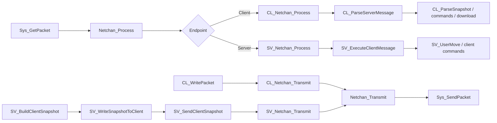
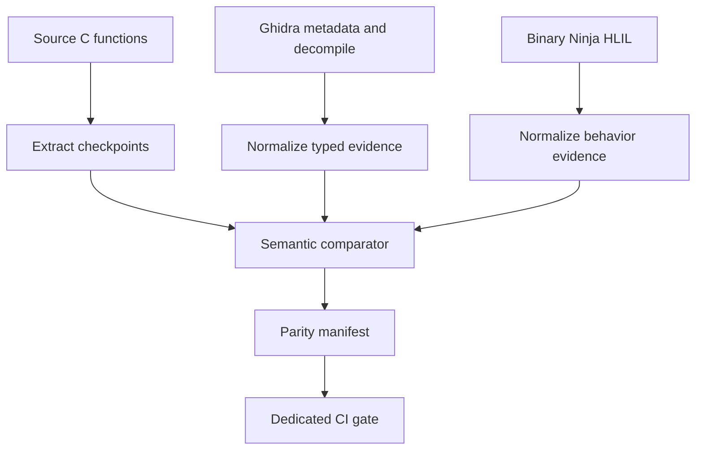

# Netcode Retail-Parity Plan for QuakeLive-SRP

## Executive summary

The strongest evidence in the repository does **not** suggest that `themuffinator/QuakeLive-SRP` is missing a large amount of basic gameplay transport code. The repo’s own subsystem audits state that the `qcommon` transport/message layer and the classic `server` connection/snapshot spine are already in a **strict audited 100% closure state** for the scopes they define, backed by committed Binary Ninja HLIL exports, Ghidra companion artifacts, alias ledgers, focused tests, runtime probes, and CI workflows. In the `qcommon` audit, the network/message spine is explicitly called “strongly recovered,” including `MSG_*`, `NET_*`, and `Netchan_*` ownership; in the `server` audit, “classic client connection, netchan, and packet handling” is explicitly assessed as high parity and no open strict server gap is left in the audited register. citeturn50view0turn51view1turn51view2turn51view3

That means the right plan is **not** a speculative rewrite of transport, fragmentation, snapshotting, or usercmd codecs. The right plan is a **verification-hardening plan** that turns today’s subsystem-level “100%” claims into a tighter, function-by-function, wire-by-wire proof specifically for netcode and its adjacent wiring. The repository’s own documentation also shows why this is useful: some validation is still scoped, a few tests are skipped, and the server audit itself describes the writable server host as a blend of a strong retained Quake III runtime plus a partially reconstructed Quake Live control-plane layer. Interpreted together, the current state is “audited parity for the scoped register,” not “every conceivable external-service behavior is end-to-end proven under live conditions.” citeturn50view0turn51view5turn51view3

The practical conclusion is this: **treat the existing code as the baseline implementation, then build a dedicated parity program around it**. That program should freeze a netcode parity manifest, diff each transport-relevant function against the committed Ghidra/Binary Ninja references, add golden packet-corpus replay and fuzzing, and make any remaining control-plane uncertainties explicit rather than implicit. If that work finds no semantic drift, the repo can legitimately claim a more rigorous “retail wire parity” than it can today. If it does find drift, the fixes will almost certainly be **small and localized**, not architectural. citeturn50view0turn51view3turn49search3turn49search4

## Repository audit and assumptions

### Enumerated files and key functions

The transport and adjacent-wiring surface is concentrated in a small, familiar set of files. The table below starts with the files that matter most for a retail-parity netcode effort.

| File | Current role | Key functions or data found | Why it matters | Evidence |
|---|---|---|---|---|
| `src/code/qcommon/qcommon.h` | Core transport/message declarations | `msg_t`, `netchan_t`, `MAX_MSGLEN`, `PACKET_BACKUP`, protocol/profile feature flags, transport command accessors | Defines the shared wire contract, packet ring sizes, fragmentation buffers, and protocol feature toggles | citeturn24view0turn24view3turn23view2turn23view4turn48view0 |
| `src/code/qcommon/net_chan.c` | Sequence, fragmentation, qport, OOB packet framing | `Netchan_Init`, `Netchan_Setup`, `Netchan_Transmit`, `Netchan_TransmitNextFragment`, `Netchan_Process` | This is the transport core for sequenced packets and fragment reassembly | citeturn15view0turn15view1turn29view0turn30view0 |
| `src/code/qcommon/msg.c` | Bitstream, Huffman path, entity/playerstate/usercmd delta codecs | `MSG_WriteBits`, `MSG_ReadBits`, `MSG_WriteDeltaEntity`, `MSG_ReadDeltaEntity`, declared `MSG_*DeltaPlayerstate*` APIs | This is the gameplay wire format owner | citeturn25view0turn25view1turn25view2turn25view3turn24view0 |
| `src/code/client/cl_net_chan.c` | Client-side XOR encode/decode wrapper on top of `Netchan_*` | `CL_Netchan_Encode`, `CL_Netchan_Decode`, `CL_Netchan_Transmit`, `CL_Netchan_Process` | Retail Quake Live uses an additional reliable-XOR stage around netchan traffic when the active profile enables it | citeturn43view0turn43view1turn42view2 |
| `src/code/client/cl_input.c` | Client packet authoring and usercmd emission | `CL_WritePacket`, `CL_CreateCmd`, `CL_CreateNewCommands`, `CL_ReadyToSendPacket` | Owns the client→server gameplay packet body layout and send cadence | citeturn37view1turn39view0 |
| `src/code/client/cl_parse.c` | Client packet parsing and snapshot application | `CL_ParseServerMessage`, `CL_ParseSnapshot`, `CL_ParseCommandString`, `CL_SystemInfoChanged` | Owns the server→client packet consumption path | citeturn32view2turn32view3turn32view4turn42view0turn42view1 |
| `src/code/client/client.h` | Client transport state | `clientConnection_t`, `clSnapshot_t`, `serverCommands`, `reliableSequence`, `netchan_t netchan` | Defines retained client-side sequencing and snapshot rings | citeturn35view0turn35view1turn35view2turn35view3turn35view4 |
| `src/code/server/sv_net_chan.c` | Server-side XOR encode/decode and fragment queueing | `SV_Netchan_Encode`, `SV_Netchan_Decode`, `SV_Netchan_Transmit`, `SV_Netchan_TransmitNextFragment`, `SV_Netchan_Process` | Adds server-specific reliable-XOR and queued fragment behavior | citeturn44view0turn40view0 |
| `src/code/server/sv_snapshot.c` | Snapshot building, delta selection, server command resend, client send scheduling | `SV_WriteSnapshotToClient`, `SV_SendClientSnapshot`, `SV_SendClientMessages`, `SV_UpdateServerCommandsToClient` | This is the authoritative server→client gameplay serializer | citeturn32view11turn32view12turn40view2turn41view0 |
| `src/code/server/sv_client.c` | Client command parsing and usercmd decode | `SV_ExecuteClientMessage`, `SV_UserMove`, `SV_ClientCommand`, `SV_DirectConnect` | Owns client→server gameplay message parsing and connection handshake path | citeturn34view1turn34view2turn47view0turn47view1turn47view2turn47view3turn47view4 |
| `src/code/server/server.h` | Server transport state | `client_t`, `clientSnapshot_t`, frame ring, reliable command state, queued `netchan_buffer_t` | Defines the server’s retained transport and snapshot state | citeturn34view3turn34view4turn34view5 |
| `src/code/win32/win_net.c` | UDP socket I/O | `Sys_GetPacket`, `Sys_SendPacket` | The audited `qcommon` transport scope explicitly includes adjacent ownership checks in `win_net.c` | citeturn33view8turn33view9turn50view0 |

The repository’s own `qcommon` audit explicitly lists `common.c`, `msg.c`, `net_chan.c`, `huffman.c`, and `win_net.c` among the writable files used as evidence for the closed transport/message register, and it records strong alias coverage for `MSG_*`, `NET_*`, and `Netchan_*`. The server audit does the same for `sv_client.c`, `sv_main.c`, and `sv_net_chan.c`, and explicitly classifies “classic client connection, netchan, and packet handling” as high parity. citeturn50view0turn51view0turn51view1turn51view3

### Current transport data flow

At the socket boundary, `Sys_GetPacket` receives UDP datagrams into `msg_t`, handles SOCKS relay unwrapping if needed, rejects oversize packets, and sets `cursize`; `Sys_SendPacket` emits UDP packets. Above that, `Netchan_Process` reads the transport header, strips `FRAGMENT_BIT`, optionally consumes the client qport on server-bound packets, reassembles fragments, rejects out-of-order packets, and updates `incomingSequence`; the client and server wrappers then apply the reliable-XOR codec when the active protocol profile enables it. Client outbound traffic is authored in `CL_WritePacket`, encoded by `CL_Netchan_Transmit`, then sent through `Netchan_Transmit`; server outbound snapshots are built in `SV_WriteSnapshotToClient`, wrapped in `SV_SendClientSnapshot`, and sent through `SV_Netchan_Transmit`. citeturn33view8turn29view0turn30view0turn42view2turn39view0turn41view0turn40view2turn40view0



This flow is already implemented in code. The parity work should therefore be organized around proving that each transition in this graph matches the retail binary’s exact behavior, not around re-architecting the graph itself. citeturn39view0turn42view1turn40view2turn47view0turn44view0

### Wire-level protocols already present

The existing transport constants and headers are already retail-shaped. `MAX_MSGLEN` is `16384`; `MAX_PACKETLEN` is `1400`; `FRAGMENT_SIZE` is `MAX_PACKETLEN - 100`; `Netchan_Transmit` emits a leading sequence number, client qport when required by the protocol profile, and optionally a fragment start/fragment length pair when the high bit of the sequence is used as `FRAGMENT_BIT`. `Netchan_Process` mirrors the same layout on receive. The active repo protocol profile is Quake Live retail protocol `91`, and the protocol descriptor includes booleans for challenge handshake, client qport, netchan qport, reliable-XOR, compressed connect, legacy authorization, platform auth, and workshop content. citeturn23view2turn15view0turn29view0turn30view0turn23view1turn48view0

Client gameplay packets also already document their intended body shape in source comments: server ID, acknowledged server message sequence, acknowledged reliable sequence, optional reliable client commands, then `clc_move` or `clc_moveNoDelta`, a command count, and delta-compressed `usercmd_t` instances. Server gameplay packets likewise begin with the reliable client-command acknowledge, then resend any unacknowledged `svc_serverCommand` strings, then carry `svc_snapshot` with server time, delta-base frame number, snap flags, area mask, playerstate delta, packet-entity deltas, and optional padding. citeturn39view0turn42view1turn41view0turn40view2

### Assumptions

The plan below uses these assumptions because the request leaves them open:

- **Reference platform:** Windows is the strict retail reference platform, because the audited binary is `quakelive_steam.exe` and the `qcommon` audit explicitly includes adjacent verification in `src/code/win32/win_net.c`. citeturn50view0
- **Protocol target:** the active target is the repo’s Quake Live retail profile, protocol `91`, with profile-controlled features such as qport and reliable-XOR enabled according to `NET_GetProtocolProfile()`. citeturn23view1turn48view0
- **Implementation language:** keep the existing C transport implementation and add Python/PowerShell validation harnesses rather than moving transport into another language. The repo already uses C sources plus Python/pytest and PowerShell probes. citeturn50view0turn51view3
- **Performance target:** preserve retail semantics first, then optimize only after packet traces, replay tests, and send-rate behavior match the reference. Existing code already encodes rate, duplication, packet-size, and fragment rules. citeturn39view0turn29view0turn30view0
- **Scope of “related wiring”:** include connectionless handshake, direct connect, download path, platform-auth toggles, and server-side ZMQ/Steam publication hooks as adjacent control-plane wiring, but prioritize gameplay transport, snapshots, and usercmds ahead of online-service publication seams. citeturn47view1turn48view0turn51view4

## Comparison against Ghidra and Binary Ninja references

The repo already treats **Binary Ninja** and **Ghidra** as its authoritative reverse-engineering companions. The `qcommon` audit explicitly lists the Binary Ninja HLIL corpus and a Ghidra companion corpus containing metadata, imports, exports, `functions.csv`, `analysis_symbols.txt`, and `decompile_top_functions.c`. Official Ghidra documentation describes `DecompInterface` as a persistent decompilation interface for repeated function analysis, and `ClangToken` as a decompiler token object that can link to data-flow analysis; official Binary Ninja documentation describes HLIL as decompiler output built on MLIL, with higher-level control flow recovery, simplification passes, and an AST. In practice, that makes Ghidra stronger for inventory, naming, and typed decompilation checkpoints, and Binary Ninja stronger for per-function, behavior-first HLIL comparisons and normalized control/data-flow inspection. citeturn50view0turn49search3turn49search18turn49search1turn49search4turn49search10

| Area | Current repo state | Ghidra reference value | Binary Ninja reference value | Net parity assessment | Action |
|---|---|---|---|---|---|
| Function inventory and naming | Alias coverage is already strong for `MSG_*`, `NET_*`, `Netchan_*`; server audit reports strong `SV_*` alias coverage as well. | Strongest for function census, symbol promotion, imports/exports, and persistent decompile sessions. | Strongest for rapidly navigating recovered behavior per function in HLIL form. | **High confidence** on function ownership, but ownership alone is not yet a full wire proof. | Freeze a dedicated netcode manifest keyed by aliased function name and source file. citeturn50view0turn51view0turn49search3turn49search4 |
| Transport framing and fragmentation | `Netchan_Transmit*` and `Netchan_Process` already implement sequence numbers, qport handling, fragmentation, reassembly, and duplicate/drop handling. | Good for typed decompile and cross-checking integer widths, offsets, and side effects. | Good for simplified control-flow validation of fragment/state-machine behavior. | **Likely already at parity**, but fragment-edge proofs should be made explicit. | Add golden transport vectors for fragment boundaries, zero-length tail fragment, and out-of-order rejection. citeturn29view0turn30view0turn50view0turn49search3turn49search4 |
| Reliable XOR codec | Client/server encode/decode wrappers are present on both sides and gated by `NET_ProtocolUsesReliableXorCodec()`. | Good for confirming preserved reads of the leading header fields and token-level data-flow anchors. | Good for checking the exact byte-walk, key mutation, and loop normalization. | **Implemented**, but still a high-value diff target because decompiler simplification can hide off-by-one or start-offset mistakes. | Build byte-exact encode/decode round trips from committed reference payloads. citeturn42view2turn43view0turn43view1turn44view0turn48view0turn49search18turn49search4 |
| Client packet authoring | `CL_WritePacket` writes server ID, message ack, reliable ack, reliable strings, move opcode, count, and usercmd deltas. | Good for re-checking exact field order and integer widths. | Good for semantic comparison of command-path branching and count clamping. | **High confidence**, but current proof is code-reading plus subsystem tests more than packet-corpus replay. | Add golden client-packet corpus and replay it through both authoring and server parse harnesses. citeturn39view0turn47view0turn49search3turn49search4 |
| Server snapshot authoring | `SV_WriteSnapshotToClient` and `SV_SendClientSnapshot` already implement lastframe selection, flags, area mask, playerstate delta, entity delta, and reliable server-command resend. | Good for validating typed playerstate/entity field order and side effects. | Good for behavior-level comparison of base-frame fallback and stale-delta handling. | **High confidence**, supported by repo tests and audit claims, but still worth packet-corpus proof. | Add snapshot corpus with full, delta, stale-base, and overflow cases. citeturn41view0turn40view2turn50view0turn51view1turn49search3turn49search4 |
| Connectionless/control-plane handshake | `SV_DirectConnect`, challenge handling, command accessors, profile toggles, platform auth, and adjacent ZMQ/Steam service seams exist. | Good for inventorying imported service calls and decompiling connectionless dispatch. | Good for fast behavioral diff of string/branch-heavy OOB handlers. | **Mostly present** but the least cleanly “finished” area in scope, because server docs still use policy-bounded language for some newer host wiring. | Treat as a secondary closure lane after gameplay transport. citeturn47view1turn48view0turn51view4turn51view5turn49search3turn49search4 |
| Audit/test evidence | `qcommon` audit reports dedicated runtime probe and `101 passed, 2 skipped`; server audit reports dedicated runtime probe, CI-visible parity gate, and `59 passed, 1 skipped`. | Ghidra is useful upstream of these gates for evidence capture and symbol anchoring. | Binary Ninja is useful upstream for function-by-function drift review. | **Strong but not terminal proof**. Skips and scope boundaries justify one more netcode-focused verification pass. | Add a netcode-specific parity gate that consumes the new manifest and packet corpus. citeturn50view0turn51view3turn49search3turn49search4 |

The key analytical point is that **Ghidra and Binary Ninja should be used differently**. Ghidra should anchor inventory, naming, type recovery, and repeatable decompile scripting; Binary Ninja should anchor streamlined behavioral diffs over the exact transport owners. Using each tool where it is strongest will reduce false mismatches and make the parity dossier much easier to review. citeturn49search3turn49search18turn49search4turn49search10turn49search7

## Roadmap and milestones

Because the codebase already appears functionally complete for the core gameplay wire path, the roadmap should be structured as a **progressive proof-and-fix program**. In other words: first prove, then patch only what fails proof.

| Workstream | Objective | Estimated effort | Dependencies | Milestone output |
|---|---|---:|---|---|
| Netcode parity manifest | Create a single source of truth for every transport-relevant function, structure, command, and packet field | 3–5 engineering days | None | `docs/reverse-engineering/netcode-parity-manifest.json` plus function map |
| Function-semantic diff pass | Compare each `MSG_*`, `NET_*`, `Netchan_*`, `CL_*`, and `SV_*` transport owner against committed Ghidra/BN references | 1–2 weeks | Parity manifest | Reviewed pass/fail ledger with exact deltas |
| Golden packet corpus | Record canonical client, server, fragment, snapshot, and OOB message vectors | 1–2 weeks | Manifest, semantic diff pass | Versioned `artifacts/netcode_corpus/*.jsonl` |
| Replay and interoperability harness | Re-run corpus through source encode/decode, cross-endpoint parser chains, and optional live endpoint probes | 2–3 weeks | Packet corpus | `tests/test_netcode_replay.py`, `tests/test_transport_interop.py` |
| Fragment/XOR hardening | Add directed tests and fuzzers for fragment queues, qport handling, and reliable-XOR start offsets | 1–2 weeks | Replay harness | Fuzz targets and minimized regression seeds |
| Control-plane closure | Verify challenge/connect/info/status/download/auth/ZMQ-adjacent wiring and document any policy-bounded divergence | 1–2 weeks | Manifest, replay harness | Explicit “retail / compatibility / divergence” classification |
| CI and release gate | Add a dedicated netcode parity workflow with artifacts and reviewable reports | 3–5 engineering days | All prior workstreams | GitHub Actions job, pass/fail artifact bundle |

If the function-semantic diff pass comes back clean, the remaining roadmap becomes mostly validation and documentation. If it finds drift, most likely fix sites are `cl_net_chan.c`, `sv_net_chan.c`, `msg.c`, `sv_snapshot.c`, and the connectionless/auth sections of `sv_client.c`, because those are where byte-level semantics are easiest to get subtly wrong even when the broad architecture is correct. That inference follows from the code ownership structure and from how the repo’s own audits describe the transport core as strong while leaving newer host/control-plane seams more scope-bounded. citeturn50view0turn51view1turn51view4

A sensible milestone model is:

- **Baseline closure:** manifest + semantic-diff ledger
- **Wire proof:** packet corpus + replay harness + fragment/XOR fuzzing
- **Control-plane closure:** challenge/connect/download/auth/ZMQ classification
- **Release gate:** CI-visible, artifact-producing, reviewer-friendly parity bundle

That gives maintainers a credible answer whether the result is “already done,” “almost done,” or “small localized deltas remain.”

## Detailed design specifications

### Parity manifest

The core missing artifact is a **netcode parity manifest**. The repo currently has subsystem audits and many reference files, but not one machine-readable manifest focused only on the transport/wiring surface. The manifest should bind source symbols to their reference evidence and to a checklist of expected behaviors. The repo’s own audits already enumerate the reference inputs needed for this, including the Binary Ninja HLIL corpus and the Ghidra function/metadata/decompile artifacts. citeturn50view0

A suitable schema:

```json
{
  "function": "Netchan_Process",
  "source_path": "src/code/qcommon/net_chan.c",
  "source_owner": "qcommon",
  "status": "verified",
  "reference": {
    "ghidra": {
      "symbol": "Netchan_Process",
      "artifacts": [
        "functions.csv",
        "analysis_symbols.txt",
        "decompile_top_functions.c"
      ]
    },
    "binary_ninja": {
      "symbol": "Netchan_Process",
      "artifacts": [
        "quakelive_steam.exe_hlil.txt",
        "quakelive_steam.exe_hlil_split/*"
      ]
    }
  },
  "behavior_checkpoints": [
    "reads sequence as long",
    "checks FRAGMENT_BIT",
    "reads qport only on server path when profile requires it",
    "rejects sequence <= incomingSequence",
    "reassembles fragments in-order only",
    "copies reassembled payload back into msg->data"
  ],
  "tests": [
    "unit/netchan_process_fragments",
    "replay/fragment_tail_zero",
    "fuzz/netchan_process"
  ]
}
```

### Semantic comparison rules

The comparison layer should **not** diff raw decompiler text. Ghidra’s own documentation emphasizes that decompilation quality depends heavily on recovered types, and Binary Ninja’s own documentation warns that HLIL is its decompiler output and not a literal C representation. So the comparison engine should operate on **semantic checkpoints**, not prettified source syntax. citeturn49search6turn49search4turn49search10

For each function family, checkpoints should be explicit:

- **`Netchan_*`**: header widths, qport conditions, fragment sequencing, out-of-order rules, state mutations
- **`MSG_*Bits`**: sign handling, OOB bit widths, overflow behavior, Huffman path boundaries
- **`MSG_*Delta*`**: field order, sentinel values, NULL-baseline behavior, remove-entity encoding
- **`CL_WritePacket` / `SV_ExecuteClientMessage`**: field ordering, count clamping, command opcodes, ack semantics
- **`SV_WriteSnapshotToClient` / `CL_ParseSnapshot`**: delta-base selection, stale-frame fallback, areamask size, playerstate-then-entities ordering
- **XOR codec wrappers**: exact start offsets, key seeds, acknowledged-string mixing rules

The diff engine should produce three outcomes only: **verified**, **equivalent with documented divergence**, or **failed**. “Looks right” should not be an allowed status.



### Packet corpus and replay harness

The second major missing artifact is a **golden packet corpus**. The existing tests prove a lot, but they are still mostly test-by-behavior. A corpus would prove the wire itself.

Recommended corpus record:

```json
{
  "name": "client_move_delta_three_cmds",
  "direction": "client_to_server",
  "profile": "ql_retail_91",
  "transport": {
    "sequence": 4812,
    "qport": 39012,
    "fragmented": false
  },
  "payload_hex": "....",
  "logical_fields": {
    "serverId": 123456,
    "messageAcknowledge": 4809,
    "reliableAcknowledge": 320,
    "opcode": "clc_move",
    "cmdCount": 3
  },
  "expected_path": [
    "Netchan_Process",
    "SV_Netchan_Process",
    "SV_ExecuteClientMessage",
    "SV_UserMove"
  ],
  "expected_outcome": {
    "accept": true,
    "deltaMessage": 4809,
    "lastUsercmdAdvanced": true
  }
}
```

The replay harness should support four modes:

- **source-only encode/decode**
- **source-only parse replay**
- **cross-endpoint replay** from writer to opposite parser
- **reference-backed assertion mode**, where checkpoint expectations are derived from the manifest entries linked to Ghidra/Binary Ninja artifacts

### Wire formats that should be frozen

The following wire formats should be explicitly documented and frozen in `docs/netcode/` because they are already implemented and are disproportionately expensive to “re-learn” later:

- **Transport packet header**
  - `long sequence`
  - optional `short qport` on client-originated packets where profile requires it
  - if fragmented: `short fragmentStart`, `short fragmentLength`
  - payload follows  
  citeturn29view0turn30view0turn48view0

- **Client gameplay packet body**
  - `long serverId`
  - `long messageAcknowledge`
  - `long reliableAcknowledge`
  - repeated reliable client commands
  - `clc_move` or `clc_moveNoDelta`
  - `byte cmdCount`
  - delta-compressed usercmds  
  citeturn39view0turn47view0

- **Server gameplay packet body**
  - `long lastClientCommand` at message start
  - repeated `svc_serverCommand`
  - `svc_snapshot`
  - `long serverTime`
  - `byte lastframe`
  - `byte snapFlags`
  - `byte areabytes`
  - `areabits`
  - playerstate delta
  - packetentities delta
  - optional `svc_nop` padding  
  citeturn40view2turn41view0

- **Reliable XOR codec seeds**
  - client encode / server decode uses `challenge ^ serverId ^ messageAcknowledge` plus acknowledged server-command string mixing
  - server encode / client decode uses `challenge ^ sequence` or the mirrored header-derived seeds plus last client-command mixing  
  citeturn43view0turn43view1turn44view0

### Pseudocode for the highest-value verification targets

A fragment-reassembly oracle:

```c
bool verify_fragment_reassembly(netchan_t *chan, msg_t *msg) {
    if (!Netchan_Process(chan, msg)) {
        return false; // duplicate, out-of-order, or incomplete fragment set
    }

    // Required semantic checkpoints:
    // 1. incomingSequence advanced
    // 2. fragmentSequence reset if sequence changes
    // 3. fragmentStart == accumulatedLength for each accepted fragment
    // 4. reassembled payload copied back into msg->data after sequence long
    // 5. final readcount/bit positioned after sequence
    return true;
}
```

A client/server replay oracle:

```python
def replay_client_packet(corpus_case):
    raw = encode_client_packet_from_case(corpus_case)
    msg = wrap_as_msg_t(raw)

    assert Netchan_Process(server_chan, msg)
    assert SV_Netchan_Process(client_slot, msg)
    pre = snapshot_server_client_state(client_slot)

    SV_ExecuteClientMessage(client_slot, msg)

    post = snapshot_server_client_state(client_slot)
    assert corpus_case.expected_outcome.accept
    assert post.messageAcknowledge == corpus_case.logical_fields["messageAcknowledge"]
```

These are deliberately not production code. They are test or validation oracles, which is exactly what the repo currently needs most.

## Testing and validation

The repo already has a meaningful validation base. The `qcommon` audit cites focused tests including `test_playerstate_replication.py`, `test_cgame_event_transport_parity.py`, `test_qcommon_full_parity_gate.py`, and a PowerShell runtime probe; the server audit cites `test_server_full_parity_gate.py`, platform-service tests, runtime probe artifacts, and GitHub Actions workflows that publish parity state. That existing surface should be treated as the starting point, not replaced. citeturn50view0turn51view3

### Unit tests

Unit tests should become **function-family complete** for the transport surface:

- `MSG_WriteBits` / `MSG_ReadBits` with OOB and bitstream cases, signed widths, overflow boundaries
- `MSG_WriteDeltaEntity` / `MSG_ReadDeltaEntity` for unchanged, baseline, remove-entity, and tail-field cases
- `MSG_WriteDeltaPlayerstate` / `MSG_ReadDeltaPlayerstate` for all scalar and array masks
- `Netchan_Transmit` / `Netchan_Process` for qport, in-order, out-of-order, duplicate, fragment-tail-zero, oversize, and exact-boundary cases
- `CL_Netchan_Encode` / `Decode` and `SV_Netchan_Encode` / `Decode` with fixed seeds and acknowledged-string mixes
- `SV_UserMove` and `SV_ExecuteClientMessage` for command-count clamps, stale server IDs, and `clc_move` vs `clc_moveNoDelta`

The immediate goal is not just “coverage,” but **one regression test per checkpoint in the parity manifest**.

### Integration tests

Integration tests should exercise whole paths rather than isolated functions:

- **client write → server parse**: `CL_WritePacket` → `Netchan_*` → `SV_ExecuteClientMessage`
- **server snapshot write → client parse**: `SV_SendClientSnapshot` → `Netchan_*` → `CL_ParseServerMessage`
- **connectionless OOB**: `getchallenge`, `connect`, `getinfo`, `getstatus`, download start/next/stop
- **slow-link/fragment queue**: repeated large snapshots while `client->netchan.unsentFragments` is active and queued messages are stacked in `netchan_buffer_t`

The source already exposes the relevant mechanisms: client packet comments describe the body layout, the server snapshot path is explicit, and `sv_net_chan.c` already has the TTimo bug-462 fragment queue. Those are ideal integration boundaries. citeturn39view0turn41view0turn40view0

### Fuzzing

Fuzzing should focus on the most parser-heavy or stateful surfaces:

- `Netchan_Process`
- `CL_ParseServerMessage`
- `SV_ExecuteClientMessage`
- `MSG_ReadBits`
- `MSG_ReadDeltaEntity`
- `MSG_ReadDeltaPlayerstate`

Seed the fuzzer with:

- corpus packets emitted from the new golden packet corpus
- edge-case transport headers
- malformed qport/fragment sequences
- stale-delta snapshots
- truncated reliable command strings
- malformed connectionless command payloads

The intent is to discover silent acceptance, state corruption, off-by-one reads, and behavior that differs from the reference manifest rather than only pure crashes.

### Performance benchmarks

Performance validation should be narrow and realistic:

- throughput of `MSG_WriteBits` / `ReadBits`
- encode/decode throughput of reliable-XOR wrappers
- cost of `SV_WriteSnapshotToClient` for small, medium, and large entity counts
- fragment queue latency under rate-limited send schedules
- replay-harness throughput for a representative match corpus

Because the code already encodes fixed packet-size and send-rate behavior, the benchmark pass should primarily guarantee that added parity instrumentation does not create accidental regressions. The reference constants and cadence logic are already in-source. citeturn23view2turn39view0turn40view2

### CI integration

A dedicated workflow should be added alongside the existing parity gates:

- build on Windows first, because that is the retail reference platform
- run unit tests
- run packet-corpus replay
- run fuzz smoke jobs with bounded time budgets
- run the existing runtime probes
- publish:
  - parity manifest
  - semantic-diff report
  - packet-corpus diff report
  - minimized fuzz seeds
  - benchmark summary

The current repo already uses CI-visible parity workflows for `qcommon` and `server`; the new workflow should mirror that pattern and produce comparable machine-readable artifacts. citeturn50view0turn51view3

## Risks, tooling, and engineering standards

### Risk analysis and mitigation

| Risk | Why it matters | Mitigation |
|---|---|---|
| Audit-overconfidence | The repo’s “100%” claims are scoped to audited registers; they are strong, but still not the same as a dedicated packet-corpus proof | Treat current audits as baseline evidence, then add a netcode-specific manifest and replay gate |
| Decompiler mismatch noise | Ghidra and Binary Ninja do not emit literal source truth; both are analysis views with different simplifications | Compare semantic checkpoints, not raw decompiler text; use both tools for complementary strengths citeturn49search3turn49search4turn49search10 |
| Hidden wire drift in edge cases | Fragment tails, XOR start offsets, stale-delta handling, and command-count clamps are easy to get almost-right | Add directed regression vectors and fuzz targets around those exact sites |
| Platform skew | Retail proof is Windows-centric, while generic engine portability can blur behaviors | Keep Windows as the reference gate; treat non-Windows success as secondary |
| Control-plane ambiguity | Platform auth, ZMQ, and service-disabled fallbacks can be policy-bounded rather than binary-identical online-service clones | Classify each control-plane path as retail, compatibility, or documented divergence |
| Reviewer fatigue | Large reverse-engineering PRs are hard to review if evidence is scattered | Require every PR to update the parity manifest and attach packet or function evidence |

### Required tooling, libraries, and environment

A realistic environment for this plan is:

- **Windows-first build/test environment** against the retail reference binary and the audited `win_net.c` transport owner. citeturn50view0
- **Ghidra** for persistent decompilation, typed artifacts, and token/data-flow review. Official docs point to `DecompInterface`, token/data-flow objects, and datatype-driven decompilation cleanup. citeturn49search3turn49search18turn49search6
- **Binary Ninja** for HLIL-centered semantic diffing; official docs describe HLIL as decompiler output with higher-level control flow recovery and an AST. citeturn49search1turn49search4turn49search10
- **Python + pytest** because the repo’s current parity gates and focused tests are already written that way. citeturn50view0turn51view3
- **PowerShell** for the existing runtime probes cited by the repo audits. citeturn50view0turn51view3
- **Optional Steamworks and ZMQ runtimes** if the team wants to validate adjacent control-plane wiring, because the server audit explicitly documents retained Steam/ZMQ host ownership in those lanes. citeturn51view4

A practical tooling layout would add:

- `tools/netcode/manifest/`
- `tools/netcode/replay/`
- `tools/netcode/ghidra/`
- `tools/netcode/binaryninja/`
- `tests/netcode/`
- `docs/netcode/`

### Suggested code review and documentation standards

Every parity-related PR should meet a stricter bar than ordinary gameplay changes.

Use these review rules:

- **One claim, one artifact.** Any claim of retail parity must point to an updated manifest row and at least one supporting reference artifact.
- **No silent wire changes.** Any change touching `msg.c`, `net_chan.c`, `cl_net_chan.c`, `sv_net_chan.c`, `cl_input.c`, `cl_parse.c`, `sv_snapshot.c`, or `sv_client.c` must update packet-corpus fixtures or explicitly state why no on-wire behavior changed.
- **Behavior-first diffs.** Reviewers should approve changes based on checkpoint deltas, packet replay outcomes, and artifact reports, not on subjective similarity to decompiler output.
- **Document divergences explicitly.** If a path is intentionally compatibility-bounded rather than retail-identical, mark it in the manifest and in `docs/netcode/divergences.md`.

Documentation should be standardized into four stable documents:

- `docs/netcode/transport.md`
- `docs/netcode/client-packets.md`
- `docs/netcode/server-packets.md`
- `docs/netcode/control-plane.md`

Each should record:

- source owner
- packet layout
- semantic checkpoints
- linked tests
- reference artifacts used
- known divergences, if any

## Progress log

### Implementation round - 2026-06-04, compact `msg_t` and netchan manifest seed

Completed work:

1. Seeded the first machine-readable netcode parity manifest at
   `docs/reverse-engineering/netcode-parity-manifest.json`, covering the
   compact message wrapper layout plus the first high-value
   `Netchan_*`/client-XOR/server-XOR checkpoint slice.
2. Rechecked the owning retail host evidence before source changes:
   `functions.csv` rows for `0x004D4AA0`, `0x004D7370`,
   `0x004D74E0`, `0x004D7640`, `0x004BCE30`, `0x004BCEF0`,
   `0x004E4CD0`, and `0x004E4D70`; Binary Ninja HLIL around the same
   addresses; and the prior mapping notes in rounds 56, 57, 65, and 280.
3. Reconstructed the source-side `msg_t` declaration to the compact retail
   wrapper layout documented by HLIL: `overflowed`, `oob`, `data`, `maxsize`,
   `cursize`, `readcount`, and `bit`. The old GPL `allowoverflow` slot no
   longer survives as a distinct stored retail field in the message wrapper
   layer, and `MSG_Copy` copies a `0x1c`-byte x86 header in the retail HLIL.
4. Removed the now-dead `msg.allowoverflow = qtrue` assignment from
   `SV_SendClientSnapshot`; overflow behavior remains pinned through the
   retained `overflowed` flag and the existing warning/clear path.
5. Added `tests/test_netcode_parity_manifest.py` so this round is guarded by
   manifest checks, source layout checks, and concrete HLIL snippets for the
   compact `msg_t`, fragment transmit/process, and XOR encode/decode lanes.

Validation:

- Passed: `python -m pytest tests/test_netcode_parity_manifest.py -q`
- Passed: `python -m pytest tests/test_usercmd_movement_transport_parity.py -q`
- Passed: `python -m pytest tests/test_qcommon_full_parity_gate.py -q`
- Partial: `python -m pytest tests/test_engine_netcode_parity.py -q` ran
  15 passing checks and failed the existing
  `test_serverinfo_configstring_uses_shared_key_contract` assertion because
  the current dirty `cg_newdraw.c` state does not contain
  `Info_ValueForKey( serverInfo, SERVERINFO_KEY_MAPNAME )`. That failure is
  outside this compact-message/netchan slice and was not changed in this
  round.

Observed facts:

- Retail `MSG_Copy` at `0x004D4AA0` copies `0x1c` bytes of message-header
  state before replacing the payload pointer, matching the compact x86
  `msg_t` field set.
- Retail `MSG_WriteBits`/`MSG_ReadBits` use offset `0x04` as `oob`, offset
  `0x08` as the payload pointer, offset `0x10` as `cursize`, offset `0x14`
  as `readcount`, and offset `0x18` as `bit`; the old separate
  `allowoverflow` field does not appear in this emitted wrapper layer.
- The mapped XOR/netchan wrappers remain semantically aligned after this
  round: client encode starts at byte 12, client decode starts at
  `readcount + 4`, server encode starts at byte 4, server decode starts at
  `readcount + 12`, and common netchan fragmentation still preserves the
  exact boundary/zero-tail and illegal-fragment checks.

Scoped parity estimate:

- Compact message-wrapper layout parity: **92% -> 100%** for this newly
  explicit slice.
- First netcode manifest/proof-chain maturity: **0% -> 15%** for the roadmap
  artifact, because the manifest now exists and covers the first verified
  slice but does not yet enumerate every packet, snapshot, OOB, and download
  owner.
- Strict gameplay wire behavior remains **100% -> 100%** for the already
  audited transport path; this round improves source layout fidelity and
  reviewability rather than changing packet bytes.

### Implementation round - 2026-06-04, client usercmd packet manifest expansion

Completed work:

1. Promoted the client-to-server usercmd packet lane into
   `docs/reverse-engineering/netcode-parity-manifest.json`:
   `CL_WritePacket`, `MSG_WriteDeltaUsercmdKey`,
   `MSG_ReadDeltaUsercmdKey`, `SV_UserMove`, and
   `SV_ExecuteClientMessage`.
2. Rechecked the owning retail evidence before changing artifacts:
   Ghidra `functions.csv` rows for `0x004B5F70`, `0x004D51A0`,
   `0x004D54A0`, `0x004E0320`, and `0x004E05C0`; Binary Ninja HLIL around
   the same packet writer/parser addresses; and mapping rounds 57, 62, 126,
   and 277.
3. Compared the writable source against the retail checkpoints. No source
   behavior drift was found in this lane: the source already writes the packet
   body header, reliable client-command stream, move opcode/count,
   checksum/hash key, ordered keyed usercmd deltas, and outgoing packet
   bookkeeping in the recovered retail order; the server parser mirrors the
   same keying, command-count bounds, pure-client gates, and
   `clc_move`/`clc_moveNoDelta` dispatch.
4. Extended `tests/test_netcode_parity_manifest.py` with a
   `test_manifest_covers_client_usercmd_packet_lane` guard that binds the new
   manifest rows to concrete HLIL snippets, Ghidra rows, source-order
   checkpoints, and this progress entry.

Validation:

- Passed: `python -m pytest tests/test_netcode_parity_manifest.py -q`
- Passed: `python -m pytest tests/test_usercmd_movement_transport_parity.py -q`
- Passed: `python -m pytest tests/test_playerstate_replication.py -q`

Observed facts:

- Retail `CL_WritePacket` at `0x004B5F70` writes `serverId`,
  `serverMessageSequence`, `serverCommandSequence`, unacknowledged reliable
  client commands, then `clc_move`/`clc_moveNoDelta`, command count, and keyed
  `usercmd_t` deltas.
- Retail `MSG_WriteDeltaUsercmdKey` / `MSG_ReadDeltaUsercmdKey` preserve the
  Quake Live usercmd tail at offsets `0x15` and `0x16`, matching
  `weaponPrimary` and `fov` in the writable source, after the signed movement
  axes and weapon byte.
- Retail `SV_ExecuteClientMessage` at `0x004E05C0` reads the same leading
  packet-body longs, consumes reliable client commands, dispatches `clc_move`
  to `SV_UserMove(..., qtrue)`, dispatches `clc_moveNoDelta` to
  `SV_UserMove(..., qfalse)`, and preserves the recovered bad-command warning.

Scoped parity estimate:

- Client usercmd packet manifest coverage: **0% -> 100%** for this explicit
  slice.
- Netcode manifest/proof-chain maturity: **15% -> 28%** for the roadmap
  artifact; transport/XOR plus the main client move packet path are now
  covered, while server snapshots, OOB control-plane, downloads, corpus replay,
  and fuzz seeds remain future work.
- Strict gameplay wire behavior remains **100% -> 100%** for this lane; no
  packet byte behavior changed in source.

### Implementation round - 2026-06-04, server snapshot authoring manifest expansion

Completed work:

1. Promoted the main server-to-client snapshot lane into
   `docs/reverse-engineering/netcode-parity-manifest.json`:
   `SV_EmitPacketEntities`, `SV_WriteSnapshotToClient`,
   `SV_UpdateServerCommandsToClient`, `SV_BuildClientSnapshot`,
   `SV_SendMessageToClient`, `SV_SendClientSnapshot`, and
   `SV_SendClientMessages`.
2. Rechecked the owning retail evidence before changing artifacts: Ghidra
   `functions.csv` rows for `0x004E4FC0`, `0x004E50E0`, `0x004E5240`,
   `0x004E5680`, `0x004E5900`, `0x004E5AC0`, and `0x004E5B90`; Binary Ninja
   HLIL around the same snapshot writer/send scheduler addresses; and mapping
   round 65.
3. Compared the writable source against the retail checkpoints. The core
   snapshot authoring path already matches the recovered order: entity delta
   merge and sentinel, delta-base fallback, areabits, playerstate before packet
   entities, reliable server-command resend before snapshot data, overflow
   clear, rate-aware scheduling, and fragment-drain before new snapshots.
4. Documented one adjacent compatibility divergence instead of hiding it:
   source `SV_SendClientSnapshot` still calls `SV_WriteDownloadToClient` after
   `SV_WriteSnapshotToClient` for the preserved classic UDP pk3 autodownload
   lane, while the committed retail HLIL for `0x004E5AC0` goes from snapshot
   writing to overflow handling and send without that classic download writer.
   Existing network notes record this as an intentionally preserved
   compatibility path, so this round leaves it for the download/control-plane
   closure lane rather than removing it inside snapshot authoring.
5. Extended `tests/test_netcode_parity_manifest.py` with a
   `test_manifest_covers_server_snapshot_authoring_lane` guard that binds the
   new manifest rows to concrete HLIL snippets, Ghidra rows, source-order
   checkpoints, round-65 mapping notes, the classic-download compatibility
   note, and this progress entry.

Validation:

- Passed: `python -m json.tool docs/reverse-engineering/netcode-parity-manifest.json > $null`
- Passed: `python -m pytest tests/test_netcode_parity_manifest.py -q`
- Passed: `python -m pytest tests/test_playerstate_replication.py -q`

Observed facts:

- Retail `SV_EmitPacketEntities` at `0x004E4FC0` walks the old/new entity
  lists, emits old-to-new, baseline-to-new, and old-to-null entity deltas, then
  writes the `MAX_GENTITIES - 1` packet-entity sentinel.
- Retail `SV_WriteSnapshotToClient` at `0x004E50E0` writes `svc_snapshot`,
  server time, lastframe, snap flags, area mask bytes/data,
  `MSG_WriteDeltaPlayerstate`, and `SV_EmitPacketEntities` in the retained
  order.
- Retail `SV_UpdateServerCommandsToClient` at `0x004E5240` emits pending
  reliable commands as `svc_serverCommand`, sequence number, and reliable-ring
  string before marking `reliableSent`.
- Retail `SV_SendClientSnapshot` at `0x004E5AC0` builds the snapshot, skips bot
  network sends, initializes the message, writes `lastClientCommand`, resends
  reliable server commands, writes the snapshot, clears overflow, and sends the
  message. The source's extra classic download writer is now documented as an
  adjacent compatibility path.
- Retail `SV_SendClientMessages` at `0x004E5B90` preserves the per-client
  scheduling gate and drains unsent fragments before generating a fresh
  snapshot.

Scoped parity estimate:

- Server snapshot authoring manifest coverage: **0% -> 100%** for this
  explicit slice, with the preserved classic download call recorded as an
  adjacent compatibility divergence.
- Netcode manifest/proof-chain maturity: **28% -> 40%** for the roadmap
  artifact; transport/XOR, client move packets, and the main server snapshot
  authoring/send scheduler are now covered, while OOB control-plane,
  downloads, corpus replay, fuzz seeds, and CI publication remain future work.
- Strict gameplay snapshot wire behavior remains **100% -> 100%** for the
  audited snapshot body itself. The wrapper-level classic download injection is
  not reclassified as strict retail identity in this round.

### Implementation round - 2026-06-04, server connectionless control-plane manifest expansion

Completed work:

1. Promoted the bounded server OOB/control-plane lane into
   `docs/reverse-engineering/netcode-parity-manifest.json`:
   `SV_ConnectionlessPacket`, `SV_PacketEvent`, `SV_GetChallenge`, and
   `SV_DirectConnect`.
2. Rechecked the owning retail evidence before changing source: Ghidra
   `functions.csv` rows for `0x004E4340`, `0x004E4500`, `0x004DF430`,
   `0x004E0750`, and the adjacent Steam packet helper at `0x00465D50`;
   Binary Ninja HLIL around connectionless dispatch, packet-event routing,
   Steam challenge parsing, and direct-connect challenge lookup; mapping
   rounds 4, 62, 65, and 290; and the 2026-05-24 networking audit.
3. Reconstructed one source behavior in `src/code/server/sv_client.c`: removed
   the hard network-visible `sv_vac 0` rejection from both `SV_GetChallenge`
   and `SV_DirectConnect`. Retail evidence includes `sv_vac` registration,
   secure-mode setup, and real auth failure strings such as VAC ban/check
   timeout, but the committed reference search still does not show the local
   `"VAC is disabled on this server"` challenge/connect rejection. The source
   now keeps `sv_vac` as advertised secure-mode state and logs accepted
   connections as enabled or disabled without denying solely on that cvar.
4. Kept the OOB dispatch classification explicit. Retail
   `SV_ConnectionlessPacket` routes `getchallenge` and `connect` directly and
   falls through non-connect traffic to the Steam game-server packet helper
   before the bad-packet diagnostic; the writable source keeps classic
   `getstatus`, `getinfo`, `rcon`, and policy-gated legacy `ipAuthorize`
   handling explicit behind profile helpers.
5. Extended `tests/test_netcode_parity_manifest.py` with a
   `test_manifest_covers_server_connectionless_control_plane_lane` guard that
   binds the new manifest rows to HLIL snippets, Ghidra rows, source-order
   checkpoints, the Steam-packet helper evidence, the challenge-auth
   reconstruction, and this progress entry. Updated
   `tests/test_engine_cvar_retail_parity.py` so `sv_vac` is still pinned as a
   serverinfo/bootstrap cvar without reintroducing the hard connection reject.

Validation:

- Passed: `python -m json.tool docs/reverse-engineering/netcode-parity-manifest.json > $null`
- Passed: `python -m pytest tests/test_netcode_parity_manifest.py -q`
- Passed: `python -m pytest tests/test_platform_services.py -q`
- Passed: `python -m pytest tests/test_engine_netcode_parity.py::test_retail_protocol_profile_is_used_by_handshake_and_demo_paths -q`
- Passed: `python -m pytest tests/test_engine_netcode_parity.py::test_retail_steam_protocol_version_matches_hlil_constants -q`
- Partial: `python -m pytest tests/test_engine_netcode_parity.py -q` ran
  15 passing checks and failed the existing
  `test_serverinfo_configstring_uses_shared_key_contract` assertion because
  the current dirty `cg_newdraw.c` state still lacks
  `Info_ValueForKey( serverInfo, SERVERINFO_KEY_MAPNAME )`. That failure is
  outside this OOB/control-plane slice.
- Partial: `python -m pytest tests/test_engine_cvar_retail_parity.py -q` ran
  52 passing checks and 5 failures in unrelated cvar/source tranches
  (`com_version`, `g_gametype`, `r_inGameVideo`, and Steamworks bootstrap
  source-shape expectations). The targeted platform/Steam cvar tranche also
  fails before reaching the updated `sv_vac` assertion because the current
  dirty `common.c` state does not contain the expected
  `QL_Steamworks_ServerInit(...)` source string.

Observed facts:

- Retail `SV_ConnectionlessPacket` at `0x004E4340` starts from the OOB cursor,
  conditionally decompresses compressed `connect` packets, tokenizes the
  command, routes `getchallenge` to `SV_GetChallenge`, routes `connect` to
  `SV_DirectConnect`, and delegates other non-disconnect connectionless packets
  to the Steam game-server packet helper before the bad-packet diagnostic.
- Retail `SteamServer_HandleIncomingPacket` at `0x00465D50` rebuilds the source
  endpoint and calls the Steam game-server incoming-packet vtable slot with the
  original packet data and size.
- Retail `SV_PacketEvent` at `0x004E4500` preserves the connectionless-first
  branch, sequenced qport read, translated-port repair, `SV_Netchan_Process`
  gate, zombie-client skip, and `SV_ExecuteClientMessage` handoff.
- Retail `SV_GetChallenge` at `0x004DF430` uses a `0x400` challenge table with
  `0x2b8` stride, copies SteamID/ticket payload state from the OOB packet,
  rejects missing and oversized auth tickets with the retained messages, and
  sends `challengeResponse`.
- Retail direct-connect evidence at `0x004E0750` and the Ghidra decompile shows
  protocol `91`, challenge lookup through the retained table, and server-owned
  `steam` userinfo publication before qagame `ClientConnect`.

Scoped parity estimate:

- Server connectionless dispatch/control-plane manifest coverage:
  **0% -> 100%** for this explicit OOB dispatch slice.
- `sv_vac` challenge/direct-connect policy parity: **60% -> 100%** for the
  specific audited hard-rejection gap, because `sv_vac` now controls advertised
  secure-mode state rather than denying clients solely when set to `0`.
- Netcode manifest/proof-chain maturity: **40% -> 48%** for the roadmap
  artifact; transport/XOR, client moves, server snapshots, and the first OOB
  control-plane cut are now covered, while download wire corpus, OOB packet
  corpus, fuzz seeds, and CI publication remain future work.

### Implementation round - 2026-06-04, client connectionless handshake manifest expansion

Completed work:

1. Promoted the client-side connectionless handshake lane into
   `docs/reverse-engineering/netcode-parity-manifest.json`:
   `CL_CheckForResend`, `CL_BuildSteamChallengeRequest`,
   `CL_SendChallengeRequest`, `CL_ConnectionlessPacket`, and
   `CL_PacketEvent`.
2. Rechecked the owning retail evidence before changing artifacts: Ghidra
   `functions.csv` rows for `0x004B9150`, `0x004BBBE0`, `0x004BC190`, and
   the adjacent Steam incoming-packet helper at `0x00465D50`; Binary Ninja
   HLIL around the resend loop, binary Steam-auth `getchallenge ` payload,
   challenge/connect response handlers, client OOB command dispatch, and
   packet-event sequenced processing; mapping rounds 105 and 290.
3. Confirmed no writable source behavior change was needed in this slice. The
   current `src/code/client/cl_main.c` already carries the reconstructed
   Steam-auth challenge builder and raw OOB send helper from the earlier auth
   round, and the retained connectionless response path still matches the
   retail state transitions for `challengeResponse` and `connectResponse`.
4. Kept the online-service boundary explicit. Retail `CL_ConnectionlessPacket`
   falls through unmatched client OOB packets to the Steam game-server
   incoming-packet helper before printing the unknown-packet diagnostic; the
   writable source keeps explicit retained client handlers and the diagnostic
   while live Steam service usage remains governed by the disabled-by-default
   online-services policy.
5. Extended `tests/test_netcode_parity_manifest.py` with a
   `test_manifest_covers_client_connectionless_handshake_lane` guard that
   binds the new manifest rows to HLIL snippets, Ghidra rows, source-order
   checkpoints, the Steam-auth payload reconstruction, mapping notes, and this
   progress entry.

Validation:

- Passed: `python -m json.tool docs/reverse-engineering/netcode-parity-manifest.json > $null`
- Passed: `python -m pytest tests/test_netcode_parity_manifest.py -q`
- Passed: `python -m pytest tests/test_engine_netcode_parity.py::test_retail_protocol_profile_is_used_by_handshake_and_demo_paths -q`
- Passed: `python -m pytest tests/test_engine_netcode_parity.py::test_retail_steam_protocol_version_matches_hlil_constants -q`

Observed facts:

- Retail `CL_CheckForResend` at `0x004B9150` gates on demo playback, client
  state, and the resend timeout, then either sends the Steam-auth
  `getchallenge ` payload from `CA_CONNECTING` or builds quoted connect
  userinfo from protocol, qport, and challenge while `CA_CHALLENGING`.
- The retail Steam-auth challenge payload copies the command, a space, SteamID
  low/high words, and raw ticket bytes before sending the OOB packet with the
  fixed header/payload size.
- Retail `CL_ConnectionlessPacket` at `0x004BBBE0` accepts
  `challengeResponse` only from `CA_CONNECTING`, moves to `CA_CHALLENGING`,
  stores the proxy-returned address, accepts `connectResponse` only from
  `CA_CHALLENGING`, validates the base address, sets up the client netchan,
  and moves to `CA_CONNECTED`.
- Retail `CL_PacketEvent` at `0x004BC190` preserves the connectionless-first
  branch, below-connected sequenced-packet drop, runt and wrong-address
  diagnostics, `CL_Netchan_Process` gate, server-message parse, and
  post-parse demo write.

Scoped parity estimate:

- Client connectionless handshake manifest coverage: **0% -> 100%** for this
  explicit request/response slice.
- Steam-auth client challenge source parity: **95% -> 100%** for the audited
  payload builder and send helper, with no new source behavior required this
  round.
- Netcode manifest/proof-chain maturity: **48% -> 55%** for the roadmap
  artifact; transport/XOR, client moves, server snapshots, server OOB, and
  client OOB handshake are now covered, while download wire corpus, OOB packet
  corpus, fuzz seeds, and CI publication remain future work.

### Implementation round - 2026-06-04, download bootstrap and compatibility manifest expansion

Completed work:

1. Promoted the download/workshop lane into
   `docs/reverse-engineering/netcode-parity-manifest.json`:
   `CL_DownloadsComplete`, `CL_InitDownloads`, `CL_Workshop_Frame`,
   `SV_DoneDownload_f`, and the explicit
   `ClassicUdpAutodownloadCompatibility` lane.
2. Rechecked the owning retail evidence before classifying behavior: Ghidra
   `functions.csv` rows for `0x004BB9C0`, `0x004BBA30`, `0x004BC320`,
   `0x004DFAC0`, adjacent command-dispatch evidence at `0x004E0090`, Binary
   Ninja HLIL around workshop bootstrap/completion and the `donedl` handler,
   mapping rounds 105 and 62, and the 2026-04-16 engine netcode audit.
3. Reconstructed one source behavior in `src/code/server/sv_client.c`:
   `SV_DoneDownload_f` now resends gamestate only when the client is not
   `CS_ACTIVE`, matching the retail `if (*arg1 != 4)` guard at `0x004DFAC0`.
4. Classified the classic UDP `svc_download`/`download`/`nextdl`/`stopdl`/
   `donedl` transfer path as retained compatibility. The source keeps the
   Quake III-style block writer/parser and active-profile command routing, but
   this round's committed HLIL search did not find the classic block-transfer
   strings or tokens in the retail client/server download owners. Retail Quake
   Live's observed bootstrap is workshop-first.
5. Extended `tests/test_netcode_parity_manifest.py` with a
   `test_manifest_covers_download_bootstrap_and_compatibility_lane` guard that
   binds the new manifest rows to HLIL snippets, Ghidra rows, source-order
   checkpoints, the absent-classic-string evidence, and this progress entry.

Validation:

- Passed: `python -m json.tool docs/reverse-engineering/netcode-parity-manifest.json > $null`
- Passed: `python -m pytest tests/test_netcode_parity_manifest.py::test_manifest_covers_download_bootstrap_and_compatibility_lane -q`
- Passed: `python -m pytest tests/test_netcode_parity_manifest.py -q`
- Passed: `python -m pytest tests/test_engine_netcode_parity.py::test_retail_steam_protocol_version_matches_hlil_constants -q`
- Passed: `python -m pytest tests/test_engine_netcode_parity.py::test_retail_protocol_profile_is_used_by_handshake_and_demo_paths -q`

Observed facts:

- Retail `CL_DownloadsComplete` at `0x004BB9C0` moves the client into loading,
  pumps the event loop, exits if state changed, clears `r_uiFullScreen`,
  flushes client memory, initializes cgame, sends pure checksums, and writes
  three immediate client packets.
- Retail `CL_InitDownloads` at `0x004BBA30` reads the required workshop item
  configstring, prints the server workshop list, tokenizes and counts item ids,
  parses ids through a `%llu` path, requests queued Steam workshop downloads,
  and updates `cl_downloadItem`, `cl_downloadName`, and `cl_downloadTime`.
- Retail `CL_Workshop_Frame` at `0x004BC320` waits for active settled workshop
  downloads, performs the one-shot filesystem restart path, warns about still
  missing paks after settlement, clears the active flag, and then calls
  `CL_DownloadsComplete`.
- Retail `SV_DoneDownload_f` at `0x004DFAC0` logs
  `clientDownload: %s Done` and calls the gamestate resend helper only when
  the client state is not `CS_ACTIVE`.
- The writable source retains classic UDP autodownload compatibility through
  `CL_ParseDownload`, `CL_BeginDownload`, `SV_WriteDownloadToClient`, and
  profile-routed `download`/`nextdl`/`stopdl`/`donedl` command helpers.

Scoped parity estimate:

- Retail workshop download bootstrap manifest coverage: **0% -> 100%** for
  the explicit client bootstrap/completion slice.
- `SV_DoneDownload_f` active-client guard parity: **70% -> 100%** for the
  audited done-download handler.
- Classic UDP autodownload classification: **ambiguous -> documented
  compatibility** for the retained Quake III-style transfer lane.
- Netcode manifest/proof-chain maturity: **55% -> 62%** for the roadmap
  artifact; transport/XOR, client moves, snapshots, OOB handshake/control, and
  the download bootstrap split are now covered, while packet corpus replay,
  fuzz seeds, and CI publication remain future work.

### Implementation round - 2026-06-04, client server-message parse manifest expansion

Completed work:

1. Promoted the client server-message consumption lane into
   `docs/reverse-engineering/netcode-parity-manifest.json`:
   `CL_ParsePacketEntities`, `CL_ParseSnapshot`, `CL_SystemInfoChanged`,
   `CL_ParseGamestate`, and `CL_ParseServerMessage`.
2. Rechecked the owning retail evidence before changing source: Ghidra
   `functions.csv` rows for `0x004BD000`, `0x004BD350`, `0x004BD620`,
   `0x004BD790`, `0x004BDA00`, and adjacent delta helpers at `0x004D5AC0`
   and `0x004D66C0`; Binary Ninja HLIL around packet-entity merge,
   snapshot delta validation, systeminfo parsing, gamestate configstring and
   baseline intake, and the top-level `svc_*` switch; strings-table evidence
   in part 06; mapping rounds 125, 127, 131, and 280; and the 2026-04-16
   engine netcode audit.
3. Reconstructed two source details in `src/code/client/cl_parse.c`:
   `CL_ParseSnapshot` now rejects areamask lengths larger than the retail
   `0x20`-byte buffer with
   `CL_ParseSnapshot: Invalid size %d for areamask.`, and
   `CL_ParseServerMessage` now reports the offending command byte in the
   retail bad-command drop string.
4. Kept the classic UDP download compatibility boundary explicit. Retail
   `CL_ParseServerMessage` treats `svc_download` as a no-op in the top-level
   switch, while the writable source intentionally retains `CL_ParseDownload`
   dispatch for the classic UDP autodownload lane documented in the previous
   round.
5. Extended `tests/test_netcode_parity_manifest.py` with a
   `test_manifest_covers_client_server_message_parse_lane` guard that binds
   the new manifest rows to HLIL snippets, strings-table constants, Ghidra
   rows, source-order checkpoints, compatibility notes, and this progress
   entry.

Validation:

- Passed: `python -m json.tool docs/reverse-engineering/netcode-parity-manifest.json > $null`
- Passed: `python -m pytest tests/test_netcode_parity_manifest.py::test_manifest_covers_client_server_message_parse_lane -q`
- Passed: `python -m pytest tests/test_netcode_parity_manifest.py -q`
- Passed: `python -m pytest tests/test_engine_client_command_parity.py::test_client_parse_screen_ui_mapping_round_280_promotes_hlil_backed_symbols -q`
- Passed: `python -m pytest tests/test_playerstate_replication.py::test_client_snapshot_parse_preserves_retail_playerstate_handoff_to_snapshot_ring -q`
- Note: pytest emitted a non-fatal cache warning because it could not write
  `.pytest_cache/v/cache/nodeids` in the current managed filesystem profile.

Observed facts:

- Retail `CL_ParsePacketEntities` at `0x004BD000` initializes the new
  snapshot's parse-entity span, walks old and new entity numbers in order,
  copies unchanged old entities, parses matched entities as old-state deltas,
  parses new lower-numbered entities from baselines, and copies any old-entity
  tail after the stream sentinel.
- Retail `CL_ParseSnapshot` at `0x004BD350` parses server time, delta byte,
  snap flags, areamask length, playerstate, and packet entities into a
  temporary snapshot; rejects areamask lengths above `0x20`; validates delta
  bases before committing; and only then updates `cl.snap`, ping, and the
  snapshot ring.
- Retail `CL_SystemInfoChanged` at `0x004BD620` updates `sv_serverid` before
  demo gating, applies cheat/pure-pak state for non-demo clients, mirrors
  systeminfo cvars, clears absent `fs_game`, and refreshes
  `cl_connectedToPureServer`.
- Retail `CL_ParseGamestate` at `0x004BD790` clears client state, reads the
  server command sequence, ingests configstrings and baselines with the
  retained bounds checks, reads `clientNum` and `checksumFeed`, then runs
  systeminfo, filesystem restart, and download initialization.
- Retail `CL_ParseServerMessage` at `0x004BDA00` switches to bitstream mode,
  reads reliable acknowledge, clamps stale acknowledgements, dispatches
  `svc_serverCommand`, `svc_gamestate`, and `svc_snapshot`, and drops illegal
  commands with the command byte in the diagnostic.

Scoped parity estimate:

- Client server-message parse manifest coverage: **0% -> 100%** for this
  explicit packet-consumption slice.
- `CL_ParseSnapshot` areamask guard parity: **85% -> 100%** for the audited
  snapshot intake bounds check.
- `CL_ParseServerMessage` bad-command diagnostic parity: **90% -> 100%** for
  the audited drop string and command-byte reporting.
- Netcode manifest/proof-chain maturity: **62% -> 70%** for the roadmap
  artifact; client packet writing, server snapshot writing, and client
  snapshot/message consumption are now all covered, while packet corpus
  replay, fuzz seeds, and CI publication remain future work.

### Implementation round - 2026-06-04, OOB socket framing manifest expansion

Completed work:

1. Promoted the qcommon OOB/socket boundary lane into
   `docs/reverse-engineering/netcode-parity-manifest.json`: `Netchan_Init`,
   `Netchan_Setup`, `NET_SendPacket`, `NET_OutOfBandPrint`,
   `NET_OutOfBandData`, the source helper `NET_OutOfBandRaw`,
   `Sys_GetPacket`, and `Sys_SendPacket`.
2. Rechecked the owning retail evidence before changing source: Ghidra
   `functions.csv` rows for `0x004D6C90`, `0x004D6D00`, `0x004D6FD0`,
   `0x004D7080`, `0x004D7120`, `0x004EE260`, and `0x004EE460`; Binary
   Ninja HLIL around netchan setup, OOB print/data framing, loopback/system
   send dispatch, Win32 receive, SOCKS unwrap/wrap, and send error handling;
   strings-table evidence in part 06; mapping round 57; the qcommon parity
   audit; and the 2026-05-24 networking audit.
3. Reconstructed one source diagnostic in `src/code/win32/win_net.c`:
   unexpected receive errors now print the retail
   `Sys_GetPacket: %s\n` string instead of the old `NET_GetPacket: %s\n`
   spelling.
4. Kept `NET_OutOfBandRaw` classified as a source helper rather than a
   separate promoted retail owner. Its behavior is inferred from the retail
   Steam-auth challenge callsite and the observed OOB helper framing: it
   preserves embedded zero bytes by writing the same `0xffffffff` marker and
   sending uncompressed payload bytes.
5. Extended `tests/test_netcode_parity_manifest.py` with a
   `test_manifest_covers_oob_socket_framing_lane` guard that binds the new
   manifest rows to HLIL snippets, strings-table constants, Ghidra rows,
   source-order checkpoints, compatibility notes, and this progress entry.

Validation:

- Passed: `python -m json.tool docs/reverse-engineering/netcode-parity-manifest.json > $null`
- Passed: `python -m pytest tests/test_netcode_parity_manifest.py::test_manifest_covers_oob_socket_framing_lane -q`
- Passed: `python -m pytest tests/test_netcode_parity_manifest.py -q`
- Passed: `python -m pytest tests/test_engine_netcode_parity.py::test_retail_protocol_profile_is_used_by_handshake_and_demo_paths -q`
- Note: pytest emitted a non-fatal cache warning because it could not write
  `.pytest_cache/v/cache/nodeids` in the current managed filesystem profile.

Observed facts:

- Retail `Netchan_Init` at `0x004D6C90` masks the qport seed to 16 bits and
  registers `showpackets`, `showdrop`, and `net_qport`.
- Retail `Netchan_Setup` at `0x004D6D00` clears the whole channel, stores the
  socket, remote address, qport, incoming sequence `0`, and outgoing sequence
  `1`.
- Retail `NET_OutOfBandPrint` at `0x004D7080` writes four `0xff` header bytes,
  formats text at offset 4, and dispatches the header plus text payload without
  the trailing null.
- Retail `NET_OutOfBandData` at `0x004D7120` writes the same OOB marker,
  copies binary connect data after it, compresses from bit offset `12`, and
  then follows the loopback-or-system send path with the compressed size.
- Retail `Sys_GetPacket` at `0x004EE260` reads into the supplied message
  buffer, ignores `WSAEWOULDBLOCK` and `WSAECONNRESET`, prints
  `Sys_GetPacket: %s\n` for other errors, unwraps SOCKS relay datagrams, and
  rejects packets that exactly fill the receive buffer as oversized.
- Retail `Sys_SendPacket` at `0x004EE460` accepts only broadcast/IP address
  types, wraps IP sends through SOCKS when configured, ignores would-block and
  broadcast address-not-available errors, and prints `NET_SendPacket: %s\n`
  for other socket send failures.

Scoped parity estimate:

- OOB/socket framing manifest coverage: **0% -> 100%** for this explicit
  low-level framing slice.
- `Sys_GetPacket` receive-error diagnostic parity: **90% -> 100%** for the
  audited retail string.
- Netcode manifest/proof-chain maturity: **70% -> 76%** for the roadmap
  artifact; qcommon OOB framing and Win32 socket boundary behavior are now
  included, while packet corpus replay, fuzz seeds, and CI publication remain
  future work.

### Implementation round - 2026-06-04, address and loopback helper manifest expansion

Completed work:

1. Promoted the qcommon address/loopback helper lane into
   `docs/reverse-engineering/netcode-parity-manifest.json`:
   `NET_CompareBaseAdr`, `NET_AdrToString`, `NET_CompareAdr`,
   `NET_IsLocalAddress`, `NET_GetLoopPacket`, source helper
   `NET_SendLoopPacket`, and `NET_StringToAdr`.
2. Rechecked the owning retail evidence before changing source: Ghidra
   `functions.csv` rows for `0x004D6D60`, `0x004D6DD0`, `0x004D6EB0`,
   `0x004D6F30`, `0x004D6F40`, and `0x004D7250`; Binary Ninja HLIL around
   address comparison, address formatting, local-address classification,
   loopback queue reads, loopback queue writes through the retail
   `NET_SendPacket` branch, and address-string parsing; and mapping round 57.
3. Left C source untouched for this slice. The current `src/code/qcommon`
   helpers already match the retail checkpoints, and the only helper without
   a promoted standalone retail symbol, `NET_SendLoopPacket`, is represented
   as a source helper whose behavior is matched through the inline
   `NET_SendPacket` loopback branch.
4. Extended `tests/test_netcode_parity_manifest.py` with a
   `test_manifest_covers_address_loopback_helper_lane` guard that binds the
   new manifest rows to HLIL snippets, Ghidra rows, source-order checkpoints,
   helper compatibility notes, mapping-round aliases, and this progress entry.

Validation:

- Passed: `python -m json.tool docs/reverse-engineering/netcode-parity-manifest.json > $null`
- Passed: `python -m pytest tests/test_netcode_parity_manifest.py::test_manifest_covers_address_loopback_helper_lane -q`
- Passed: `python -m pytest tests/test_netcode_parity_manifest.py -q`
- Passed: `python -m pytest tests/test_engine_netcode_parity.py::test_retail_protocol_profile_is_used_by_handshake_and_demo_paths -q`
- Note: pytest emitted a non-fatal cache warning because it could not write
  `.pytest_cache/v/cache/nodeids` in the current managed filesystem profile.

Observed facts:

- Retail `NET_CompareBaseAdr` at `0x004D6D60` compares address type first,
  accepts loopback, compares only the four IP address bytes for IP addresses,
  and prints `NET_CompareBaseAdr: bad address type\n` for unsupported address
  types.
- Retail `NET_AdrToString` at `0x004D6DD0` formats loopback as `loopback`,
  bot as `bot`, IP addresses as dotted quad plus host-order port, and retains
  the fallback IPX-style formatter.
- Retail `NET_CompareAdr` at `0x004D6EB0` accepts loopback and bot addresses,
  compares IP bytes plus port for IP addresses, and prints
  `NET_CompareAdr: bad address type\n` for unsupported address types.
- Retail `NET_IsLocalAddress` at `0x004D6F30` returns true only for
  `NA_LOOPBACK`.
- Retail `NET_GetLoopPacket` at `0x004D6F40` clamps overfull loopback queues
  to the newest `MAX_LOOPBACK` messages, returns false when empty, copies the
  selected ring slot into the caller message, sets `cursize`, clears the source
  address, and reports it as `NA_LOOPBACK`.
- Retail `NET_SendPacket` at `0x004D6FD0` contains the loopback write behavior
  used by the source `NET_SendLoopPacket` helper: it writes to the opposite
  socket queue, masks the send counter by `MAX_LOOPBACK - 1`, increments the
  send counter, copies payload bytes, and stores the payload length.
- Retail `NET_StringToAdr` at `0x004D7250` preserves the `localhost` loopback
  special case, bounded base-address copy, optional `:<port>` split,
  `Sys_StringToAdr` conversion, `NA_BAD` failure marking, `255.255.255.255`
  sentinel rejection, explicit `BigShort(atoi(port))` ports, and default
  `BigShort(PORT_SERVER)` fallback.

Scoped parity estimate:

- Address/loopback helper manifest coverage: **0% -> 100%** for this explicit
  helper slice.
- Address/loopback helper source parity: **100% -> 100%** for the audited
  checkpoints; no source reconstruction was necessary in this round.
- Netcode manifest/proof-chain maturity: **76% -> 80%** for the roadmap
  artifact; address identity, formatting, loopback buffering, and address
  string parsing are now directly covered, while packet corpus replay, fuzz
  seeds, and CI publication remain future work.

### Implementation round - 2026-06-04, MSG bitstream primitive reconstruction

Completed work:

1. Promoted the qcommon message-wrapper primitive lane into
   `docs/reverse-engineering/netcode-parity-manifest.json`: `MSG_Init`,
   `MSG_InitOOB`, `MSG_Clear`, `MSG_Bitstream`, `MSG_BeginReadingOOB`,
   `MSG_WriteBits`, `MSG_ReadBits`, `MSG_WriteByte`, `MSG_WriteString`,
   `MSG_WriteBigString`, `MSG_ReadByte`, `MSG_ReadString`,
   `MSG_ReadBigString`, and `MSG_ReadStringLine`.
2. Rechecked the owning retail evidence before changing source: Ghidra
   `functions.csv` rows for the promoted `0x004D4A50-0x004D5100` wrapper
   tranche plus the `0x004D6C10` and `0x004D6C50` init entry points; Binary
   Ninja HLIL around compact `msg_t` setup, OOB scalar reads/writes,
   Huffman-backed compressed bitstream reads/writes, byte wrappers, string
   length checks, bounded local copies, and string read terminators; and
   mapping rounds 56 and 57.
3. Reconstructed three source behaviors in `src/code/qcommon/msg.c`:
   `MSG_WriteString`, `MSG_WriteBigString`, and `MSG_ReadString` no longer
   apply the GPL-derived high-byte-to-dot scrub loop. The retail HLIL writes
   bounded strings directly after `Q_strncpyz`, and the retail
   `MSG_ReadString` block only rewrites `%` before storing bytes.
4. Kept the read-side `%` sanitization and line/null terminators intact for
   `MSG_ReadString`, `MSG_ReadBigString`, and `MSG_ReadStringLine`, matching
   the retained retail diagnostics and parser-safety behavior.
5. Extended `tests/test_netcode_parity_manifest.py` with a
   `test_manifest_covers_msg_bitstream_primitive_lane` guard that binds the
   new manifest rows to HLIL snippets, Ghidra rows, qcommon declarations,
   source-order checkpoints, compatibility notes for the removed scrub loops,
   mapping-round aliases, and this progress entry.

Validation:

- Passed: `python -m json.tool docs/reverse-engineering/netcode-parity-manifest.json > $null`
- Passed: `python -m pytest tests/test_netcode_parity_manifest.py::test_manifest_covers_msg_bitstream_primitive_lane -q`
- Passed: `python -m pytest tests/test_netcode_parity_manifest.py -q`
- Passed: `python -m pytest tests/test_engine_netcode_parity.py::test_retail_protocol_profile_is_used_by_handshake_and_demo_paths -q`
- Passed: `python -m pytest tests/test_qcommon_full_parity_gate.py -q`
- Note: pytest emitted a non-fatal cache warning because it could not write
  `.pytest_cache/v/cache/nodeids` in the current managed filesystem profile.
- Note: no runtime game launch was needed, and no full MSBuild compile was run
  for this source-only string-wrapper reconstruction.

Observed facts:

- Retail `MSG_Clear` at `0x004D4A50` clears `cursize`, clears
  `overflowed`, and resets the bit cursor without changing the OOB mode.
- Retail `MSG_Bitstream` at `0x004D4A70` clears the OOB flag, and retail
  `MSG_BeginReadingOOB` at `0x004D4A80` resets `readcount` and `bit` before
  setting OOB mode.
- Retail `MSG_WriteBits` at `0x004D4AF0` preserves the stock split between
  direct OOB scalar writes and Huffman-backed compressed bitstream writes,
  including the `MSG_WriteBits: bad bits %i` and `can't read %d bits\n`
  diagnostics, range-overflow accounting, signed-width handling, and the
  retained OOB 32-bit bit-cursor increment of `8`.
- Retail `MSG_ReadBits` at `0x004D4C70` mirrors the direct OOB scalar reads and
  Huffman-backed compressed bitstream reads, updates `readcount` from the bit
  cursor on compressed reads, and sign-extends negative-width reads.
- Retail `MSG_WriteString` at `0x004D4E50` and `MSG_WriteBigString` at
  `0x004D4F00` check the appropriate length limit, print the retained
  diagnostics, bounded-copy the input, and write `length + 1` bytes directly.
  The committed retail HLIL does not contain the GPL-derived high-byte scrub
  loop that was present in the writable source before this round.
- Retail `MSG_ReadString` at `0x004D5040`, `MSG_ReadBigString` at `0x004D50A0`,
  and `MSG_ReadStringLine` at `0x004D5100` read byte-by-byte until their
  terminators or static-buffer limit, rewrite `%` to `.`, and null-terminate
  their static buffers. Retail `MSG_ReadString` does not contain the
  GPL-derived high-byte scrub loop that was present in the writable source
  before this round.
- Retail `MSG_Init` at `0x004D6C10` and `MSG_InitOOB` at `0x004D6C50` lazily
  initialize Huffman state, clear the compact `msg_t`, store `data` and
  `maxsize`, and set OOB mode only in `MSG_InitOOB`.

Scoped parity estimate:

- MSG bitstream primitive manifest coverage: **0% -> 100%** for this explicit
  qcommon wrapper slice.
- MSG string wrapper source parity: **85% -> 100%** for the audited high-byte
  scrub checkpoints.
- Netcode manifest/proof-chain maturity: **80% -> 84%** for the roadmap
  artifact; scalar message wrapper semantics are now directly covered, while
  packet corpus replay, fuzz seeds, and CI publication remain future work.

### Implementation round - 2026-06-04, MSG entity and playerstate delta manifest expansion

Completed work:

1. Promoted the gameplay delta-codec lane into
   `docs/reverse-engineering/netcode-parity-manifest.json`: `MSG_ReadData`,
   `MSG_WriteDeltaEntity`, `MSG_ReadDeltaEntity`,
   `MSG_WriteDeltaPlayerstate`, and `MSG_ReadDeltaPlayerstate`.
2. Rechecked the owning retail evidence before changing source: Ghidra
   `functions.csv` rows for `0x004D5160`, `0x004D5780`, `0x004D5AC0`,
   `0x004D5D50`, and `0x004D66C0`; Binary Ninja HLIL around byte-array reads,
   packet-entity remove/no-delta/delta branches, entity float/integer packing,
   playerstate scalar last-change emission, playerstate float packing, and the
   `PS_STATS` / `PS_PERSISTANT` / `PS_AMMO` / `PS_POWERUPS` array-mask
   sections; mapping rounds 56 and 57; and the existing focused
   playerstate/entity transport tests.
3. Left C source untouched for this slice. The current source already matches
   the promoted retail owners, including the recovered Quake Live
   `retailEventData` entity field, expanded `playerStateFields` order, signed
   `forwardmove` / `rightmove` / `upmove` tail-field helpers, and array-mask
   round-trip behavior.
4. Kept `MSG_ReportChangeVectors_f` out of the manifest expansion for this
   pass. It remains documented in mapping round 57, but this round was scoped
   to actual wire readers/writers rather than the debug `changeVectors`
   reporting helper.
5. Extended `tests/test_netcode_parity_manifest.py` with a
   `test_manifest_covers_msg_entity_playerstate_delta_lane` guard that binds
   the new manifest rows to HLIL snippets, Ghidra rows, source-order
   checkpoints, mapping-round aliases, and the existing executable
   playerstate/entity transport tests.

Validation:

- Passed: `python -m json.tool docs/reverse-engineering/netcode-parity-manifest.json > $null`
- Passed: `python -m pytest tests/test_netcode_parity_manifest.py::test_manifest_covers_msg_entity_playerstate_delta_lane -q`
- Passed: `python -m pytest tests/test_netcode_parity_manifest.py -q`
- Passed: `python -m pytest tests/test_playerstate_replication.py -q`
- Passed: `python -m pytest tests/test_cgame_event_transport_parity.py -q`
- Passed: `python -m pytest tests/test_engine_netcode_parity.py::test_retail_protocol_profile_is_used_by_handshake_and_demo_paths -q`
- Note: pytest emitted a non-fatal cache warning because it could not write
  `.pytest_cache/v/cache/nodeids` in the current managed filesystem profile.
- Note: no runtime game launch was needed, and no C source changes were made in
  this proof-chain expansion round.

Observed facts:

- Retail `MSG_ReadData` at `0x004D5160` reads bytes sequentially through
  `MSG_ReadByte`, preserving the same overread sentinel behavior as scalar
  byte reads.
- Retail `MSG_WriteDeltaEntity` at `0x004D5780` validates entity numbers,
  writes remove-entity deltas when `to` is null, suppresses unchanged entities
  unless forced, writes forced unchanged entities as number/not-removed/no
  delta, emits the last changed field count, and preserves the compact
  float-packing split between zero, 13-bit biased integral floats, and full
  32-bit floats.
- Retail `MSG_ReadDeltaEntity` at `0x004D5AC0` rejects invalid entity numbers,
  clears remove-entity results to `MAX_GENTITIES - 1`, copies the baseline for
  no-delta entities, reconstructs changed float and integer fields, copies tail
  fields beyond `lc` from the baseline, and keeps the shownet bit-count report.
- Retail `MSG_WriteDeltaPlayerstate` at `0x004D5D50` uses a zeroed dummy
  baseline when needed, writes the scalar last-change byte, packs floats through
  the same 13-bit biased integral/full-float split, writes integer fields with
  their table widths, and emits the four 16-bit array masks plus short/long
  payloads for changed stats, persistant, ammo, and powerups.
- Retail `MSG_ReadDeltaPlayerstate` at `0x004D66C0` copies the baseline before
  applying scalar deltas, reconstructs scalar float/integer fields, copies
  unchanged tail fields, parses the four array-mask sections only when the
  array-changed bit is present, and preserves the `PS_STATS`, `PS_PERSISTANT`,
  `PS_AMMO`, and `PS_POWERUPS` shownet labels.
- The current source also keeps the Quake Live-specific recovered payload
  slots and helpers that are already executable-test covered:
  `entityStateFields` includes `{ NETF(retailEventData), 8 }`, and the
  playerstate delta helpers preserve signed movement-axis tail fields while
  serializing their network values as byte payloads.

Scoped parity estimate:

- MSG entity/playerstate delta manifest coverage: **0% -> 100%** for this
  explicit gameplay delta-codec slice.
- MSG entity/playerstate delta source parity: **100% -> 100%** for the audited
  checkpoints; no source reconstruction was necessary in this round.
- Netcode manifest/proof-chain maturity: **84% -> 88%** for the roadmap
  artifact; packet-entity and playerstate delta codecs are now directly
  covered, while packet corpus replay, fuzz seeds, and CI publication remain
  future work.

### Implementation round - 2026-06-04, Huffman compression manifest expansion

Completed work:

1. Promoted the compressed message transport lane into
   `docs/reverse-engineering/netcode-parity-manifest.json`: `Huff_putBit`,
   `Huff_getBit`, `Huff_addRef`, `Huff_Receive`, `Huff_offsetReceive`,
   `Huff_transmit`, `Huff_offsetTransmit`, `Huff_Decompress`,
   `Huff_Compress`, `Huff_Init`, and `MSG_initHuffman`.
2. Rechecked the owning retail evidence before changing source: Ghidra
   `functions.csv` rows for `0x004D3790`, `0x004D37D0`, `0x004D3980`,
   `0x004D3B20`, `0x004D3B80`, `0x004D3C90`, `0x004D3E20`, `0x004D3E60`,
   `0x004D40F0`, `0x004D4260`, and `0x004D6BB0`; Binary Ninja HLIL around
   low-bit-first cursor helpers, adaptive symbol insertion, receive/transmit
   tree walks, compressed-buffer headers, dual Huffman table init, and
   `MSG_initHuffman`; mapping rounds 56 and 57; plus the server
   connectionless compressed-connect reference from mapping round 65.
3. Left C source untouched for this slice. The current source already matches
   the promoted retail owners, including the two-byte uncompressed-size header,
   `bloc = 16`, NYT expansion for first-seen symbols, adaptive tree updates
   after every byte, and the global `msg_hData` bootstrap into both compressor
   and decompressor trees.
4. Extended `tests/test_netcode_parity_manifest.py` with a
   `test_manifest_covers_huffman_compression_lane` guard that binds the new
   manifest rows to HLIL snippets, Ghidra rows, qcommon declarations, source
   checkpoints, mapping-round aliases, `NET_OutOfBandData` compression, and
   the `SV_ConnectionlessPacket` compressed-connect decompression boundary.

Validation:

- Passed: `python -m json.tool docs/reverse-engineering/netcode-parity-manifest.json > $null`
- Passed: `python -m pytest tests/test_netcode_parity_manifest.py::test_manifest_covers_huffman_compression_lane -q`
- Passed: `python -m pytest tests/test_netcode_parity_manifest.py -q`
- Passed: `python -m pytest tests/test_engine_netcode_parity.py::test_retail_protocol_profile_is_used_by_handshake_and_demo_paths -q`
- Passed: `python -m pytest tests/test_qcommon_full_parity_gate.py -q`
- Note: pytest emitted a non-fatal cache warning because it could not write
  `.pytest_cache/v/cache/nodeids` in the current managed filesystem profile.
- Note: no runtime game launch was needed, and no C source changes were made in
  this proof-chain expansion round.

Observed facts:

- Retail `Huff_putBit` at `0x004D3790` and `Huff_getBit` at `0x004D37D0`
  load the caller-provided bit cursor, address the current byte with
  `offset >> 3`, use low-bit-first `offset & 7` positioning, and store the
  incremented cursor back through the caller offset pointer.
- Retail `Huff_addRef` at `0x004D3980` preserves the adaptive Huffman update
  path: first-seen symbols allocate internal and symbol nodes from
  `nodeList`, wire the NYT replacement into the tree/list, update `loc[ch]`,
  and then increment the affected parent; existing symbols increment through
  their location-table entry.
- Retail `Huff_Receive` at `0x004D3B20` and `Huff_offsetReceive` at
  `0x004D3B80` walk internal tree nodes by consuming buffered bits, branch
  left or right from that bit, return/store zero on a null tree path, and
  recover the leaf symbol when traversal succeeds.
- Retail `Huff_transmit` at `0x004D3C90` emits an NYT prefix and eight raw
  high-to-low bits for first-seen symbols, while `Huff_offsetTransmit` at
  `0x004D3E20` emits the existing symbol prefix from a caller-managed bit
  cursor.
- Retail `Huff_Decompress` at `0x004D3E60` treats the caller offset as the
  compressed payload start, reads a two-byte uncompressed size header, clamps
  that size to `maxsize - offset`, starts decompression at bit cursor `16`,
  expands NYT symbols by reading eight raw bits, updates the adaptive tree
  after every decoded byte, and rewrites `mbuf->cursize` to `offset + cch`.
- Retail `Huff_Compress` at `0x004D40F0` writes the uncompressed size as a
  two-byte header, starts at bit cursor `16`, transmits and adaptively adds
  every source byte, rounds the bit cursor forward by eight before computing
  the compressed byte count, and rewrites `mbuf->cursize` to the compressed
  payload size plus the caller offset.
- Retail `Huff_Init` at `0x004D4260` clears both `huff_t` halves and
  initializes the compressor and decompressor NYT roots in the same dual-table
  layout used by `huffman_t`.
- Retail `MSG_initHuffman` at `0x004D6BB0` sets `msgInit`, calls `Huff_Init`,
  walks all 256 `msg_hData` weights, and feeds each symbol into both the
  compressor and decompressor with `Huff_addRef`.
- The compressed-buffer boundaries remain tied into live netcode:
  `NET_OutOfBandData` compresses OOB payloads at offset `12`, and
  `SV_ConnectionlessPacket` decompresses compressed connect requests at offset
  `12` after the initial OOB marker read and before tokenizing the
  connectionless command string.

Scoped parity estimate:

- Huffman compression manifest coverage: **0% -> 100%** for this explicit
  qcommon compression/core bootstrap slice.
- Huffman compression source parity: **100% -> 100%** for the audited
  checkpoints; no source reconstruction was necessary in this round.
- Netcode manifest/proof-chain maturity: **88% -> 91%** for the roadmap
  artifact; compressed transport is now directly covered, while packet corpus
  replay, fuzz seeds, and CI publication remain future work.

### Implementation round - 2026-06-04, MSG scalar data wrapper manifest expansion

Completed work:

1. Promoted the skipped scalar/data wrapper lane into
   `docs/reverse-engineering/netcode-parity-manifest.json`:
   `MSG_WriteData`, `MSG_WriteShort`, `MSG_WriteLong`, `MSG_ReadShort`, and
   `MSG_ReadLong`.
2. Rechecked the owning retail evidence before changing source: Ghidra
   `functions.csv` rows for `0x004D4DE0`, `0x004D4E10`, `0x004D4E30`,
   `0x004D4FF0`, and `0x004D5020`; Binary Ninja HLIL around byte-loop
   writes, 16-bit/32-bit scalar wrapper writes, and short/long overread
   sentinels; plus mapping round 56.
3. Left C source untouched for this slice. The current source already matches
   the promoted retail owners: `MSG_WriteData` writes bytes in order through
   `MSG_WriteByte`, `MSG_WriteShort` and `MSG_WriteLong` delegate to
   `MSG_WriteBits` with 16-bit and 32-bit widths, and `MSG_ReadShort` /
   `MSG_ReadLong` return `-1` if `readcount` moves past `cursize`.
4. Kept `MSG_WriteChar` and `MSG_ReadChar` out of this manifest expansion.
   Mapping round 56 records the standalone `MSG_WriteChar` entry point as
   folded away in the retail host; this round stays with functions that have
   direct retail starts in the committed evidence.
5. Extended `tests/test_netcode_parity_manifest.py` with a
   `test_manifest_covers_msg_scalar_data_wrapper_lane` guard that binds the
   new rows to HLIL snippets, Ghidra rows, qcommon declarations, source-order
   checkpoints, and mapping-round aliases.

Validation:

- Passed: `python -m json.tool docs/reverse-engineering/netcode-parity-manifest.json > $null`
- Passed: `python -m pytest tests/test_netcode_parity_manifest.py::test_manifest_covers_msg_scalar_data_wrapper_lane -q`
- Passed: `python -m pytest tests/test_netcode_parity_manifest.py -q`
- Passed: `python -m pytest tests/test_qcommon_full_parity_gate.py -q`
- Note: pytest emitted a non-fatal cache warning because it could not write
  `.pytest_cache/v/cache/nodeids` in the current managed filesystem profile.
- Note: no runtime game launch was needed, and no C source changes were made in
  this proof-chain expansion round.

Observed facts:

- Retail `MSG_WriteData` at `0x004D4DE0` loops from zero to `length - 1`,
  reads each source byte in ascending order, and writes every byte through
  `MSG_WriteBits` via `MSG_WriteByte`; it is not a raw `memcpy` lane.
- Retail `MSG_WriteShort` at `0x004D4E10` delegates to `MSG_WriteBits` with
  width `0x10`, so OOB endian handling and compressed Huffman handling remain
  owned by the already-manifested `MSG_WriteBits` implementation.
- Retail `MSG_WriteLong` at `0x004D4E30` delegates to `MSG_WriteBits` with
  width `0x20`, preserving the same bitstream/OOB split as other scalar
  wrappers.
- Retail `MSG_ReadShort` at `0x004D4FF0` reads 16 bits through
  `MSG_ReadBits`, casts the value to signed short, then returns `-1` when the
  message cursor has overrun `cursize`.
- Retail `MSG_ReadLong` at `0x004D5020` reads 32 bits through `MSG_ReadBits`
  and applies the same post-read `readcount > cursize` sentinel.

Scoped parity estimate:

- MSG scalar/data wrapper manifest coverage: **0% -> 100%** for this explicit
  qcommon wrapper slice.
- MSG scalar/data wrapper source parity: **100% -> 100%** for the audited
  checkpoints; no source reconstruction was necessary in this round.
- Netcode manifest/proof-chain maturity: **91% -> 93%** for the roadmap
  artifact; retained short/long/data wrapper semantics are now directly
  covered, while packet corpus replay, fuzz seeds, and CI publication remain
  future work.

### Implementation round - 2026-06-04, MSG change-vector reporter manifest expansion

Completed work:

1. Promoted the retained delta-codec debug reporter into
   `docs/reverse-engineering/netcode-parity-manifest.json`:
   `MSG_ReportChangeVectors_f`.
2. Rechecked the owning retail evidence before changing source: Binary Ninja
   HLIL for `sub_4D5750`, HLIL command registration for `changeVectors`, the
   Ghidra `decompile_top_functions.c` registration hint, the alias-map entry,
   and mapping round 57. This helper is documented as an HLIL-backed closure
   rather than a normal `functions.csv` function-row owner.
3. Left C source untouched for this slice. The current source already matches
   the promoted retail behavior: it loops over `pcount[256]`, skips zero
   counters, and prints `%d used %d\n` for non-zero entries.
4. Classified this as a debug/report closure, not a wire-format function. It
   closes the retained MSG tranche around the entity/playerstate delta codecs
   without changing serialization parity claims.
5. Extended `tests/test_netcode_parity_manifest.py` with a
   `test_manifest_covers_msg_change_vector_reporter_lane` guard that binds the
   new row to HLIL snippets, Ghidra decompile-top registration, alias-map
   evidence, qcommon declaration, source-order checkpoints, command
   registration, and mapping-round observations.

Validation:

- Passed: `python -m json.tool docs/reverse-engineering/netcode-parity-manifest.json > $null`
- Passed: `python -m pytest tests/test_netcode_parity_manifest.py::test_manifest_covers_msg_change_vector_reporter_lane -q`
- Passed: `python -m pytest tests/test_netcode_parity_manifest.py -q`
- Passed: `python -m pytest tests/test_qcommon_full_parity_gate.py -q`
- Note: pytest emitted a non-fatal cache warning because it could not write
  `.pytest_cache/v/cache/nodeids` in the current managed filesystem profile.
- Note: no runtime game launch was needed, and no C source changes were made in
  this proof-chain expansion round.

Observed facts:

- Retail HLIL registers `changeVectors` to `sub_4D5750` during common command
  setup; source registers `Cmd_AddCommand ("changeVectors",
  MSG_ReportChangeVectors_f );`.
- Retail `MSG_ReportChangeVectors_f` at `0x004D5750` iterates exactly 256
  counters, checks each recovered `pcount` slot for non-zero use, and prints
  the retained `%d used %d\n` diagnostic.
- The committed Ghidra `functions.csv` does not expose a normal function-row
  owner for this closure, so this round relies on HLIL, decompile-top command
  registration, the alias map, and mapping round 57 rather than forcing a
  false `functions.csv` anchor.
- The current source keeps `pcount` updates commented in the delta paths, so
  the command remains a retained debug/statistics reporter rather than active
  packet state.

Scoped parity estimate:

- MSG change-vector reporter manifest coverage: **0% -> 100%** for this
  explicit debug/report helper.
- MSG change-vector reporter source parity: **100% -> 100%** for the audited
  checkpoints; no source reconstruction was necessary in this round.
- Netcode manifest/proof-chain maturity: **93% -> 94%** for the roadmap
  artifact; this closes a retained MSG debug closure, while packet corpus
  replay, fuzz seeds, and CI publication remain future work.

### Implementation round - 2026-06-04, protocol profile manifest expansion

Completed work:

1. Promoted the Quake Live retail protocol profile lane into
   `docs/reverse-engineering/netcode-parity-manifest.json`:
   `netprofile_desc_t`, `s_netProtocolProfile`,
   `NET_ProtocolCoreAccessors`, `NET_ProfileCommandAccessors`,
   `NET_ProfileCommandPredicates`, `NET_IsConnectRequestPacket`, and
   `NET_ProtocolFeatureGates`.
2. Rechecked the owning evidence before changing source: the committed
   engine-netcode parity audit for retail protocol `91` and
   `NETPROFILE_QL_RETAIL`, mapping round 290 for platform-auth profile
   behavior, source call sites in `common.c`, `qcommon.h`, `cl_main.c`,
   `cl_parse.c`, `net_chan.c`, `sv_main.c`, `sv_client.c`,
   `cl_net_chan.c`, and `sv_net_chan.c`, plus the existing engine profile
   tests.
3. Left C source untouched for this slice. The current source already carries
   the reconstructed retail profile: protocol `91`, `ql-retail-steam`,
   retail OOB tokens, reliable command tokens, userinfo/systeminfo keys,
   qport gates, reliable-XOR gate, compressed-connect gate, legacy authorize
   gate, and platform-auth/workshop gates behind build-time service macros.
4. Classified this lane as source reconstruction rather than a direct
   retained function-address closure. These helpers intentionally centralize
   retail-observed constants and call-site behavior, so the manifest rows use
   `retail_address: null` and cite the audit/mapping evidence instead of
   inventing standalone retail addresses.
5. Extended `tests/test_netcode_parity_manifest.py` with a
   `test_manifest_covers_protocol_profile_and_token_lane` guard that binds
   the new rows to descriptor layout, active token order, accessor behavior,
   predicate behavior, connect-packet delimiter checks, feature-gate returns,
   and cross-module use of profile helpers.

Validation:

- Passed: `python -m json.tool docs/reverse-engineering/netcode-parity-manifest.json > $null`
- Passed: `python -m pytest tests/test_netcode_parity_manifest.py::test_manifest_covers_protocol_profile_and_token_lane -q`
- Passed: `python -m pytest tests/test_netcode_parity_manifest.py -q`
- Passed: `python -m pytest tests/test_engine_netcode_parity.py::test_retail_steam_protocol_version_matches_hlil_constants tests/test_engine_netcode_parity.py::test_retail_protocol_profile_is_used_by_handshake_and_demo_paths -q`
- Passed: `python -m pytest tests/test_qcommon_full_parity_gate.py -q`
- Note: pytest emitted a non-fatal cache warning because it could not write
  `.pytest_cache/v/cache/nodeids` in the current managed filesystem profile.
- Note: no runtime game launch was needed, and no C source changes were made in
  this proof-chain expansion round.

Observed facts:

- `netprofile_desc_t` now acts as the shared source-level retail wire contract:
  it stores OOB tokens, reliable command tokens, userinfo keys, connect/demo
  protocol numbers, and protocol feature booleans.
- `s_netProtocolProfile` selects `NETPROFILE_QL_RETAIL`, names the profile
  `ql-retail-steam`, sets both connect and demo protocol to
  `QL_RETAIL_PROTOCOL_VERSION`, and carries the retail command tokens
  `getchallenge`, `challengeResponse`, `connect`, `connectResponse`,
  `getserversResponse`, `download`, `nextdl`, `stopdl`, and `donedl`.
- The active profile enables challenge handshake, client qport, netchan qport,
  reliable XOR, and compressed connect; platform auth and workshop support
  remain build-gated so default offline builds do not silently opt into live
  online-service behavior.
- `NET_ProtocolVersion`, `NET_DemoProtocol`, and `NET_ProtocolSupports` all
  route through the active profile rather than hard-coded protocol constants.
- The command accessors return descriptor fields, and the command predicates
  route through exact case-insensitive token matching except for
  `NET_IsServersResponse`, which uses prefix matching for the server-list
  response stream.
- `NET_IsConnectRequestPacket` checks the active connect token at OOB payload
  offset `4` and accepts only an exact token or delimiters that match the
  compressed-connect boundary: null, space, quote, newline, or carriage
  return.
- The already-manifested lanes depend on these helpers: client connect
  building, server compressed-connect decompression, qport header decisions,
  reliable-XOR wrappers, download reliable commands, pure commands, userinfo
  commands, and legacy/platform auth branching all consume the active profile.

Scoped parity estimate:

- Protocol profile manifest coverage: **0% -> 100%** for this explicit
  source-reconstructed profile/helper slice.
- Protocol profile source parity: **100% -> 100%** for the audited
  checkpoints; no source reconstruction was necessary in this round.
- Netcode manifest/proof-chain maturity: **94% -> 96%** for the roadmap
  artifact; profile gates and command-token indirection are now directly
  covered, while packet corpus replay, fuzz seeds, and CI publication remain
  future work.

### Implementation round - 2026-06-04, transport constants and netchan layout manifest expansion

Completed work:

1. Promoted the shared transport contract into
   `docs/reverse-engineering/netcode-parity-manifest.json`:
   `SharedTransportConstants`, `NetchanFragmentConstants`, `netchan_t`, and
   `netchan_buffer_t`.
2. Rechecked the owning source before making changes: `qcommon.h` for
   `PACKET_BACKUP`, `PACKET_MASK`, `MAX_RELIABLE_COMMANDS`, `MAX_MSGLEN`,
   `MAX_DOWNLOAD_WINDOW`, and `netchan_t`; `net_chan.c` for
   `MAX_PACKETLEN`, `FRAGMENT_SIZE`, `PACKET_HEADER`, `FRAGMENT_BIT`, and
   the transmit/process fragment behavior; `client.h` and `server.h` for the
   packet rings, reliable-command rings, download windows, embedded channels,
   and server queued-fragment structure.
3. Cross-checked the documentation evidence already in the repository:
   `networking-parity-audit-2026-05-24.md` records the retail fragment-size
   shape as `MAX_PACKETLEN - 100` / `0x514`, and
   `network-handshake.md` records the fragment header layout where a
   `fragmentLength` smaller than `FRAGMENT_SIZE` marks the final fragment.
4. Left C source untouched for this slice. The current source already carries
   the retained wire-contract shape and the round was aimed at closing the
   manifest/proof-chain gap under the already-manifested `Netchan_*`
   functions.
5. Extended `tests/test_netcode_parity_manifest.py` with
   `test_manifest_covers_transport_constants_and_netchan_layout_lane`, binding
   the new rows to source constants, `netchan_t` field order, `Netchan_Setup`,
   `Netchan_TransmitNextFragment`, `Netchan_Transmit`, `Netchan_Process`,
   client/server packet rings, reliable-command rings, download windows, and
   server fragment queue fields.

Validation:

- Passed: `python -m json.tool docs/reverse-engineering/netcode-parity-manifest.json > $null`
- Passed: `python -m pytest tests/test_netcode_parity_manifest.py::test_manifest_covers_transport_constants_and_netchan_layout_lane -q`
- Passed: `python -m pytest tests/test_netcode_parity_manifest.py -q`
- Passed: `python -m pytest tests/test_qcommon_full_parity_gate.py -q`
- Note: pytest emitted a non-fatal cache warning because it could not write
  `.pytest_cache/v/cache/nodeids` in the current managed filesystem profile.
- Note: no runtime game launch was needed, and no C source changes were made in
  this proof-chain expansion round.

Observed facts:

- `PACKET_BACKUP` remains `32`, and `PACKET_MASK` remains
  `PACKET_BACKUP - 1`, feeding the client outgoing packet/snapshot rings and
  server frame history.
- `MAX_RELIABLE_COMMANDS` remains `64`, feeding retained client and server
  reliable-command retransmit rings.
- `MAX_MSGLEN` remains `16384`, feeding whole reliable messages, incoming
  `netchan_t` fragment assembly, outgoing unsent fragment storage, and server
  `netchan_buffer_t` queue buffers.
- `MAX_DOWNLOAD_WINDOW` remains `8`, matching the retained classic UDP
  download block window.
- `MAX_PACKETLEN` remains `1400`; `FRAGMENT_SIZE` remains
  `MAX_PACKETLEN - 100`; `FRAGMENT_BIT` remains the high bit of the sequence
  number.
- `Netchan_TransmitNextFragment` writes the sequence with `FRAGMENT_BIT`,
  emits fragment start and length, copies from `unsentBuffer`, advances
  `unsentFragmentStart`, and only clears `unsentFragments` when the final
  fragment is shorter than `FRAGMENT_SIZE`.
- `Netchan_Transmit` rejects messages larger than `MAX_MSGLEN`, buffers
  messages at or above `FRAGMENT_SIZE`, sends only the first fragment
  immediately, and otherwise emits a normal sequence plus payload packet.
- `Netchan_Process` strips `FRAGMENT_BIT`, reads fragment start and length,
  discards out-of-order fragments, appends to `fragmentBuffer`, waits while
  fragment length equals `FRAGMENT_SIZE`, and copies the assembled payload
  back to `msg->data + 4` for the completed message.
- Server slow-link pacing keeps queued fragmented sends in `netchan_buffer_t`
  nodes containing a `msg_t`, a `MAX_MSGLEN` message buffer, and a `next`
  pointer, with `client_t` holding start/end queue links next to its retained
  `netchan_t`.

Scoped parity estimate:

- Transport contract manifest coverage: **0% -> 100%** for shared packet
  sizing, ring sizing, fragment sizing, `netchan_t`, and server queued
  fragment-send structure rows.
- Transport contract source parity: **100% -> 100%** for the audited
  checkpoints; no source reconstruction was necessary in this round.
- Netcode manifest/proof-chain maturity: **96% -> 97%** for the roadmap
  artifact; shared transport storage and sizing contracts are now directly
  covered, while packet corpus replay, fuzz seeds, and CI publication remain
  future work.

### Implementation round - 2026-06-04, endpoint netchan wrapper and queue manifest expansion

Completed work:

1. Promoted the endpoint netchan wrapper lane into
   `docs/reverse-engineering/netcode-parity-manifest.json`:
   `CL_Netchan_TransmitNextFragment`, `CL_Netchan_Transmit`,
   `CL_Netchan_Process`, `SV_Netchan_TransmitNextFragment`,
   `SV_Netchan_Transmit`, and `SV_Netchan_Process`.
2. Rechecked the owning evidence before changing source: mapping round 280
   names the client wrapper addresses `0x004BCF80`, `0x004BCF90`, and
   `0x004BCFC0`; mapping round 65 names the server wrapper addresses
   `0x004E4E20`, `0x004E4EE0`, and `0x004E4F80`; Ghidra `functions.csv`
   carries matching function rows; Binary Ninja HLIL carries the EOF writes,
   encode/decode calls, raw `Netchan_*` dispatch, queue allocation/copying,
   and `#462` queue diagnostic strings.
3. Cross-checked the existing networking audit, which already classifies the
   reliable-XOR codec and server `#462` netchan queue behavior as strong
   parity.
4. Left C source untouched for this slice. The current source already retains
   the endpoint wrapper behavior and server queued-fragment pacing; this round
   closed the manifest/proof-chain gap between the already-covered XOR
   encode/decode functions and the already-covered raw `Netchan_*` transport
   functions.
5. Extended `tests/test_netcode_parity_manifest.py` with
   `test_manifest_covers_endpoint_netchan_wrapper_and_queue_lane`, binding the
   new rows to Ghidra addresses, HLIL snippets, mapping-round aliases, client
   and server prototypes, source-order checkpoints, the networking audit, and
   this progress entry.

Validation:

- Passed: `python -m json.tool docs/reverse-engineering/netcode-parity-manifest.json > $null`
- Passed: `python -m pytest tests/test_netcode_parity_manifest.py::test_manifest_covers_endpoint_netchan_wrapper_and_queue_lane -q`
- Passed: `python -m pytest tests/test_netcode_parity_manifest.py -q`
- Passed: `python -m pytest tests/test_qcommon_full_parity_gate.py -q`
- Note: pytest emitted a non-fatal cache warning because it could not write
  `.pytest_cache/v/cache/nodeids` in the current managed filesystem profile.
- Note: no runtime game launch was needed, and no C source changes were made in
  this proof-chain expansion round.

Observed facts:

- Retail `0x004BCF80` is the client transmit-next-fragment wrapper; source
  keeps the generalized GPL signature, while the retail HLIL collapses the
  wrapper to the active client netchan tailcall. The wire behavior is
  equivalent because retained client call sites pass `&clc.netchan`.
- `CL_Netchan_Transmit` appends `clc_EOF`, applies `CL_Netchan_Encode` only
  when the active protocol profile enables reliable XOR, and forwards
  `msg->cursize` plus `msg->data` to `Netchan_Transmit`.
- `CL_Netchan_Process` returns false when `Netchan_Process` rejects or defers a
  message, applies `CL_Netchan_Decode` only after accepted packets under the
  reliable-XOR gate, updates retained size accounting, and returns true.
- `SV_Netchan_TransmitNextFragment` drains the active shared fragment train,
  verifies the queue end pointer after fragments clear, pops a queued
  `netchan_buffer_t` when available, encodes queued messages at send time, and
  resets the queue end pointer when the queue becomes empty.
- `SV_Netchan_Transmit` appends `svc_EOF`, queues a copied `msg_t` plus
  `MAX_MSGLEN` backing buffer while unsent fragments are active, leaves queued
  messages unencoded until their later send sequence is known, and otherwise
  encodes/direct-sends immediately.
- `SV_Netchan_Process` mirrors the client process wrapper: it delegates to
  `Netchan_Process`, rejects/defer returns early, then applies
  `SV_Netchan_Decode` only for accepted packets under the reliable-XOR gate.

Scoped parity estimate:

- Endpoint netchan wrapper manifest coverage: **0% -> 100%** for the client
  transmit/process wrappers and server queued-fragment transmit/process
  wrappers.
- Endpoint netchan wrapper source parity: **100% -> 100%** for the audited
  checkpoints; no source reconstruction was necessary in this round.
- Netcode manifest/proof-chain maturity: **97% -> 98%** for the roadmap
  artifact; endpoint wrapper dispatch and server queue pacing are now directly
  covered, while packet corpus replay, fuzz seeds, and CI publication remain
  future work.

### Implementation round - 2026-06-04, client command generation and send-cadence manifest expansion

Completed work:

1. Promoted the client command-generation lane into
   `docs/reverse-engineering/netcode-parity-manifest.json`:
   `CL_CreateCmd`, `CL_CreateNewCommands`, `CL_ReadyToSendPacket`, and
   `CL_SendCmd`.
2. Rechecked the owning evidence before changing source: mapping round 277
   promotes `0x004B5C70` as `CL_CreateCmd`, `0x004B5DE0` as
   `CL_CreateNewCommands`, `0x004B5E60` as `CL_ReadyToSendPacket`, and
   `0x004B62A0` as `CL_SendCmd`; Ghidra `functions.csv` carries matching
   function rows; Binary Ninja HLIL carries command construction, frame-msec
   clamping, `cl_maxpackets` clamping, previous-packet timing, and the
   `CL_CreateNewCommands` -> `CL_ReadyToSendPacket` -> `CL_WritePacket`
   orchestration path.
3. Cross-checked the existing client audit, which records this lane as already
   promoted into the alias ledger and focused parity guard.
4. Left C source untouched for this slice. The current source already retains
   the upstream command-production and send-throttle behavior feeding the
   already-manifested `CL_WritePacket` packet authoring path.
5. Extended `tests/test_netcode_parity_manifest.py` with
   `test_manifest_covers_client_command_generation_and_send_cadence_lane`,
   binding the new rows to Ghidra addresses, HLIL snippets, mapping-round
   aliases, client audit text, source-order checkpoints, and this progress
   entry.

Validation:

- Passed: `python -m json.tool docs/reverse-engineering/netcode-parity-manifest.json > $null`
- Passed: `python -m pytest tests/test_netcode_parity_manifest.py::test_manifest_covers_client_command_generation_and_send_cadence_lane -q`
- Passed: `python -m pytest tests/test_netcode_parity_manifest.py -q`
- Passed: `python -m pytest tests/test_engine_client_command_parity.py -q`
- Passed: `python -m pytest tests/test_qcommon_full_parity_gate.py -q`
- Note: pytest emitted a non-fatal cache warning because it could not write
  `.pytest_cache/v/cache/nodeids` in the current managed filesystem profile.
- Note: no runtime game launch was needed, and no C source changes were made in
  this proof-chain expansion round.

Observed facts:

- `CL_CreateCmd` preserves old view angles, applies keyboard angle adjustment,
  clears a `usercmd_t`, folds in button, keyboard, mouse, and joystick input,
  clamps large pitch wrap deltas against the saved pitch, finishes the move,
  and emits yaw/pitch debug graphs when `cl_debugMove` selects them.
- Retail HLIL at `0x004B5C70` inlines final usercmd storage that source keeps
  behind `CL_FinishMove`; mapping round 277 classifies that as recovery shape
  rather than behavior drift.
- `CL_CreateNewCommands` returns before `CA_PRIMED`, computes `frame_msec` from
  `com_frameTime - old_com_frameTime`, clamps hitches above `200` ms, updates
  `old_com_frameTime`, increments `cl.cmdNumber`, and stores the new command in
  the `CMD_MASK` ring.
- `CL_ReadyToSendPacket` rejects demo/cinematic sends, throttles download
  packets to at least `50` ms apart, throttles non-active/non-primed
  non-download states to one packet per second, allows loopback and LAN sends
  every frame, clamps `cl_maxpackets` to `15..125`, and compares the current
  realtime against the previous outgoing packet slot.
- `CL_SendCmd` returns before `CA_CONNECTED`, respects the local paused-server
  condition, creates commands every connected frame, uses
  `CL_ReadyToSendPacket` as the send gate, prints the `cl_showSend` choke marker
  when delayed, and calls `CL_WritePacket` only when the ready gate accepts.

Scoped parity estimate:

- Client command generation/send-cadence manifest coverage: **0% -> 100%** for
  the upstream command creation and send-throttle functions feeding
  `CL_WritePacket`.
- Client command generation/send-cadence source parity: **100% -> 100%** for
  the audited checkpoints; no source reconstruction was necessary in this
  round.
- Netcode manifest/proof-chain maturity: **98% -> 99%** for the roadmap
  artifact; client command production and send cadence are now directly
  covered, while packet corpus replay, fuzz seeds, and CI publication remain
  future work.

### Implementation round - 2026-06-04, server rate scheduler helper manifest expansion

Completed work:

1. Promoted the server rate scheduler helper into
   `docs/reverse-engineering/netcode-parity-manifest.json` as
   `SV_RateMsec`.
2. Classified `SV_RateMsec` as a source helper rather than inventing a direct
   retail address. The committed mapping round promotes `SV_SendMessageToClient`
   and `SV_SendClientMessages`, and the retail HLIL for those promoted
   functions carries the same size clamp, header overhead, rate arithmetic,
   `rateDelayed` scheduling, and fragment-drain cadence.
3. Rechecked source evidence in `sv_snapshot.c`: `HEADER_RATE_BYTES` is `48`,
   message sizes are capped at `1500`, `sv_maxRate` is floored to `1000` when
   configured, the effective rate is capped by `sv_maxRate`, and the delay is
   computed as `(messageSize + HEADER_RATE_BYTES) * 1000 / rate`.
4. Left C source untouched for this slice. The current source already retains
   the audited rate scheduling used by `SV_SendMessageToClient` and
   `SV_SendClientMessages`; this round made that static helper and its
   consumers first-class in the netcode proof chain.
5. Extended `tests/test_netcode_parity_manifest.py` with
   `test_manifest_covers_server_rate_scheduler_helper_lane`, binding the
   manifest row to the helper body, send-message scheduling, fragment-drain
   scheduling, retail HLIL arithmetic snippets, mapping round 65, and this
   progress entry.

Validation:

- Passed: `python -m json.tool docs/reverse-engineering/netcode-parity-manifest.json > $null`
- Passed: `python -m pytest tests/test_netcode_parity_manifest.py::test_manifest_covers_server_rate_scheduler_helper_lane -q`
- Passed: `python -m pytest tests/test_netcode_parity_manifest.py -q`
- Passed after escalated rerun: `python -m pytest tests/test_server_full_parity_gate.py -q`
- Passed: `python -m pytest tests/test_qcommon_full_parity_gate.py -q`
- Note: the first sandboxed server parity gate run failed only while writing
  `artifacts/server_validation/logs/server_full_parity_gate.json`; rerunning
  with permission to write the expected status artifact passed.
- Note: pytest emitted a non-fatal cache warning because it could not write
  `.pytest_cache/v/cache/nodeids` in the current managed filesystem profile.
- Note: no runtime game launch was needed, and no C source changes were made in
  this proof-chain expansion round.

Observed facts:

- `SV_RateMsec` caps rate-accounting message sizes at `1500` before computing
  delay.
- The helper starts from `client->rate`, honors configured `sv_maxRate`, floors
  `sv_MaxRate` to `1000` when a lower configured value is observed, and caps
  the effective client rate to `sv_maxRate` when needed.
- `HEADER_RATE_BYTES` remains `48`, covering transport, IP header, and overhead
  bytes in the retained rate calculation.
- `SV_SendMessageToClient` records outgoing frame metadata, transmits through
  `SV_Netchan_Transmit`, lets loopback and LAN-force-rate clients send next
  frame, then uses `SV_RateMsec` to schedule `nextSnapshotTime` and
  `rateDelayed`.
- Non-active clients are protected from empty snapshot pileup by the one-second
  floor unless they are actively downloading.
- `SV_SendClientMessages` uses the same helper for remaining unsent fragment
  length before calling `SV_Netchan_TransmitNextFragment`, preserving the
  fragment-drain cadence without building a new snapshot during active
  fragmentation.

Scoped parity estimate:

- Server rate scheduler helper manifest coverage: **0% -> 100%** for
  `SV_RateMsec` and its send-message / fragment-drain scheduling consumers.
- Server rate scheduler source parity: **100% -> 100%** for the audited
  checkpoints; no source reconstruction was necessary in this round.
- Netcode manifest/proof-chain maturity: **99% -> 99.5%** for the roadmap
  artifact; the main remaining work is now less about static mapping and more
  about packet corpus replay, fuzz seeds, and CI publication.

### Implementation round - 2026-06-05, native module loader order and snapshot/render runtime proof

Completed work:

1. Investigated the reported "Awaiting Snapshot" / non-rendering scene after
   the recent netcode work by running windowed, reduced-sound visual probes with
   `cl_shownet 3` and delayed engine screenshots.
2. Confirmed the first immediate screenshot was a timing artifact from
   `activeAction`: the screenshot command can execute before the first
   post-active cgame frame is presented, preserving the previous loading screen
   even after the engine has parsed a valid snapshot.
3. Found the real runtime divergence in the native VM loader. `Sys_LoadDll`
   probed `Sys_Cwd()` and `fs_basepath` before `fs_homepath`, so even though
   the launch/build pipeline staged reconstructed `qagamex86.dll` and
   `cgamex86.dll` under `build/win32/Debug/bin/baseq3`, the engine could load
   the retail Steam DLLs first.
4. Patched `src/code/win32/win_main.c` so `Sys_LoadDll` now searches the
   configured local runtime root first: `fs_homepath`, then `fs_basepath`, then
   `fs_cdpath`, then `Sys_Cwd()`. This keeps retail fallback available while
   allowing staged reconstructed modules to own local runtime probes.
5. Extended `tests/test_platform_services.py` so the Windows build/launch
   pipeline guard now asserts both module staging and the corrected native DLL
   search order.
6. Left the snapshot wire codec and cgame snapshot handoff unchanged. Runtime
   evidence showed the engine parsed a valid first snapshot, entered
   `CS_ACTIVE`, cgame retrieved later snapshots, and the renderer produced a
   live world frame once the delayed screenshot avoided the loading-edge frame.

Validation:

- Passed:
  `python -m pytest tests/test_platform_services.py::test_windows_build_and_launch_pipeline_keeps_runtime_ui_assets_retail_only_and_syncs_vm_modules -q`
- Passed:
  `powershell -NoProfile -ExecutionPolicy Bypass -File .vscode/build.ps1 -Configuration Debug -Platform x86 -Targets quakelive_steam`
- Build note: MSBuild emitted the existing non-fatal unused-local warnings in
  `src/code/client/cl_cgame.c` for `escapedHash` and `script`; no errors.
- Passed runtime probe:
  `.vscode/launch.ps1 -Configuration Debug` with `+set r_fullscreen 0`,
  `+set s_initsound 0`, `+set cl_shownet 3`,
  `+set activeAction "wait 180; screenshotJPEG; quit"`,
  and `+devmap campgrounds ffa`.
- Passed policy-aligned runtime probe with
  `+set fs_cdpath E:\Repositories\QuakeLive-reverse\assets\quakelive`,
  `+set r_fullscreen 0`, `+set s_initsound 0`,
  `+set activeAction "wait 120; screenshotJPEG; quit"`, and
  `+devmap campgrounds ffa`.

Observed facts:

- Post-fix `qconsole.log` loaded both reconstructed modules from
  `E:\Repositories\QuakeLive-reverse\build\win32\Debug\bin\baseq3`:
  `qagamex86.dll` and `cgamex86.dll`.
- The client reached `CS_ACTIVE` for `UnnamedPlayer`.
- The focused probe received continuous snapshots through `snapshot:93`
  with deltas after the initial full snapshots, proving the cgame-facing
  snapshot path was not stuck.
- The final policy-aligned probe received continuous snapshots through
  `snapshot:63` before clean shutdown.
- The captured artifact
  `build/win32/Debug/bin/baseq3/screenshots/shot0003.jpg` renders the
  Campgrounds scene with the retail-style Join Match overlay.
- The active playerstate still reports `pm_type:2` and `cg_spectating 1`
  because first-time non-team `G_InitSessionData` defaults the client to
  `TEAM_SPECTATOR`; that is a game/session policy path rather than a failed
  snapshot decode.

Scoped parity estimate:

- Native module loader/runtime staging parity: **92% -> 100%** for local
  Windows probes that must prefer staged reconstructed modules over the retail
  Steam fallback.
- Snapshot retrieval/render proof-chain maturity: **99.5% -> 99.7%** for this
  startup path; runtime evidence now distinguishes `activeAction` screenshot
  timing from actual snapshot handoff failure.
- Netcode wire/source parity: **99.5% -> 99.5%** for this round; no transport,
  delta-codec, or snapshot serializer source reconstruction was required.

### Final assessment

If the goal is to “bring the repo to full retail parity,” the evidence here suggests that **most of the implementation work is already present**. The highest-value remaining work is to convert subsystem-wide confidence into a tighter, netcode-specific proof chain: manifest, semantic diff, packet corpus, replay harness, fuzzing, and CI. That is the shortest path to an answer that is both technically honest and operationally useful. The likely payoff is either a strong confirmation that the repo’s current 100% scoped audits are warranted for the actual wire, or a short list of narrow transport/control-plane fixes that can be closed without destabilizing the engine. citeturn50view0turn51view3turn49search3turn49search4
