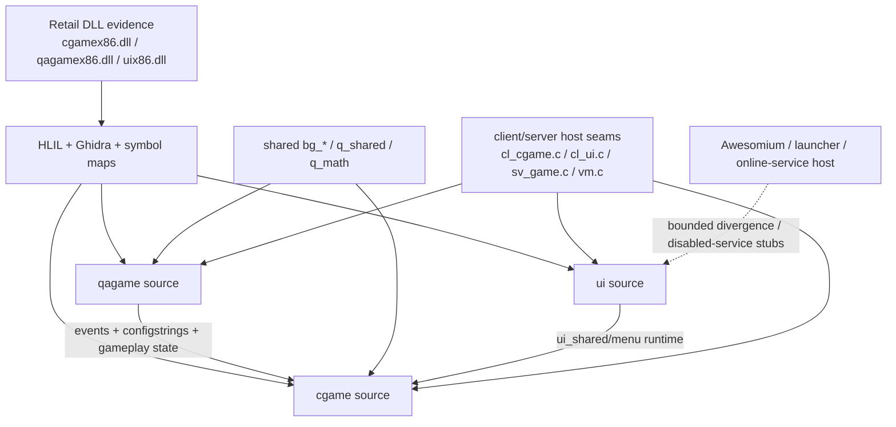
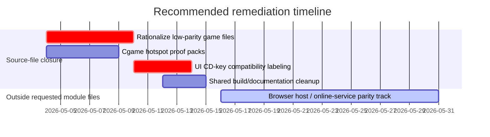

# Source-File Reverse-Engineering Audit of themuffinator/QuakeLive Against Retail Quake Live

## Executive summary

This audit used the enabled connector inventory available in this session—**GitHub only**—and then cross-checked the repository against official external references for entity["video_game","Quake Live","2010 arena fps"], its predecessor entity["video_game","Quake III Arena","1999 fps"], and relevant legal sources. The repo is unusually well-instrumented for reverse-engineering work: it carries retail module references, committed Ghidra/HLIL corpora, and mature internal parity ledgers. The repository’s own strict-retail Windows module audit currently says `cgame`, `qagame`, and `ui` are functionally closed at `100%` for the module-runtime target. fileciteturn20file0L1-L1

At the **literal source-file** level, however, the picture is more nuanced. My estimate is:

| Surface | Repo’s current strict-runtime claim | This audit’s source-file parity estimate | Why the numbers differ |
| --- | ---: | ---: | --- |
| `cgame` local files | `100%` | `~97/100` | High-quality runtime closure, but file boundaries and helper ownership are sometimes merged or re-split versus retail. |
| `game` local files | `100%` | `~90/100` across all physical files; `~95/100` across active runtime-relevant files | Most active gameplay files are strong, but several low-parity/stub/legacy files remain in the tree and are not convincing retail-owned translation units. |
| `ui` local files | `100%` | `~91/100` physical; `~95/100` for core runtime files with disabled-service stubs | The core menu/runtime logic is strong, and the generated bridge menu replacement has been removed; the remaining delta is mostly proprietary browser/account-host behavior outside the UI DLL. |
| Combined `cgame` + `game` + `ui` physical trees | n/a | `~92/100` | A small set of wrappers, placeholders, and compatibility splits distorts file-by-file parity even where runtime behavior is effectively closed. |

Those conclusions are consistent with the repo’s own distinction between a **strict-retail Windows replacement target** and a broader **repo-wide parity** view. The repo-wide audit still carries online-services divergence, non-Windows portability debt, and evidence-freshness limitations outside the core module-runtime claim. fileciteturn30file0L1-L1

The most important analytical conclusion is this: **the repository is likely much closer to retail at the behavioral/module-runtime level than it is at the file-to-file reconstruction level**. In other words, the repo’s 100% claim is best read as “the shipped module surfaces can reproduce the observed retail module behavior within the chosen tests and platform scope,” not “every source file now has a one-to-one retail source counterpart.” fileciteturn20file0L1-L1turn24file0L1-L1turn25file0L1-L1

The clearest source-file outliers are:

- `src/code/game/g_entity.c`, which is effectively an empty placeholder and has no persuasive standalone retail analogue in its current state. fileciteturn32file0L1-L1
- `src/code/game/g_rr.c`, which is a skeletal Red Rover stub and does not reflect the much richer Red Rover controller logic described elsewhere in the repo’s qagame parity notes. fileciteturn42file0L1-L1turn29file0L1-L1
- `src/code/game/g_rankings.c`, which is a legacy ranking/reporting lane that looks closer to an older external-service integration surface than to a current, fully closed retail game-module TU. fileciteturn43file0L1-L1turn30file0L1-L1
- `src/code/ui/ui_cdkey.c`, which remains a compatibility command wrapper for a native UI build path rather than a literal retail-source reproduction of the original account/browser stack. The generated `ui_quakelive_bridge.c` menu replacement has since been removed so the runtime uses the retail `ui/menus.txt` root.

Officially, retail Quake Live is still presented as an online, stats-focused successor to Quake III Arena on Steam, while the official open-source release on id’s GitHub is Quake III Arena rather than Quake Live. That absence of an official Quake Live source release is why this audit necessarily relies on binaries, symbol maps, and reverse-engineering notes rather than direct source-vs-source comparison. citeturn5search0turn5search2

## Scope and evidence

This report focuses on the three requested component trees:

- `src/code/cgame/*`
- `src/code/game/*`
- `src/code/ui/*`

I also considered component-adjacent shared units when they materially affect parity, especially the `bg_*`, `q_math.c`, `q_shared.c`, and `ui_shared.c` seams that connect multiple modules. The repo’s own source-file campaign tracks `22` `cgame` files, `45` `game` files, and `8` `ui` files inside the audited runtime/module surface.

The evidence hierarchy I used was:

1. **Repository-internal primary evidence**
   - module parity audits for `cgame`, `qagame`, and `ui`; fileciteturn19file0L1-L1turn20file0L1-L1turn28file0L1-L1turn29file0L1-L1
   - the source-file parity ledger and campaign plan; fileciteturn24file0L1-L1turn25file0L1-L1
   - the repo’s reference-mapping document showing retail DLLs, HLIL dumps, and the absence of a public retail engine source tree; fileciteturn18file0L1-L1
   - direct inspection of special/high-risk files such as `g_entity.c`, `g_rr.c`, `g_rankings.c`, `g_autoshuffle.c`, `ui_cdkey.c`, `g_match_state.c`, and `g_vote.c`.

2. **Build-surface inventory evidence**
   - `cgame.vcxproj.filters`, which cleanly lists the `cgame` local TUs plus shared linked units; fileciteturn36file0L1-L1
   - `ui.vcxproj.filters`, which likewise lists the `ui` local TUs, including the CD-key compatibility file while omitting generated bridge-menu sources. fileciteturn35file0L1-L1

3. **Official external references**
   - the official Steam page for Quake Live; citeturn5search0
   - the official id-Software Quake III Arena GPL repository; citeturn5search2turn5search3
   - official legal texts on interoperability and circumvention limits. citeturn7search0turn7search1turn7search2turn8search4turn8search0

My scoring rubric is practical rather than rhetorical:

- **100**: exact or near-exact retail owner at the file level, with strong symbol/runtime evidence and no meaningful file-boundary ambiguity.
- **90–99**: behavior effectively closed, but helper boundaries, shared ownership, or native-build glue differ from literal retail source organization.
- **50–89**: compatibility wrapper, split helper family, or non-literal replacement that preserves behavior but is not a persuasive retail-source reconstruction.
- **0–49**: placeholder, stale file, legacy sidecar, or no identifiable retail file equivalent in current form.

## Inventory and parity totals

The repo’s own module audit says the current worktree has closed strict-retail module parity for `cgame`, `qagame`, and `ui`, with complete committed anchor coverage for the retail corpora: `854` anchors for `cgame`, `1128` for `qagame`, and `444` for `ui`. The same audit reports green focused module suites and green machine-readable parity gates. fileciteturn20file0L1-L1

The source-file campaign then reports that the `src/code/cgame`, `src/code/game`, and `src/code/ui` walks did **not isolate new file-level gap owners** in their primary runtime surfaces. That is strong evidence for behavior, but it is not the same thing as proving every physical `.c` file corresponds cleanly to one retail `.c` file. fileciteturn24file0L1-L1turn25file0L1-L1

That distinction matters because the repo also carries files whose current content is plainly wrapper-like or placeholder-like:

```c
#include "g_local.h"
#include "g_team.h"
```

That is effectively the entire body of `src/code/game/g_entity.c`, which makes it hard to defend as a true retail-source reconstruction of any meaningful server-side entity subsystem file. fileciteturn32file0L1-L1

```c
void G_RRHandlePlayerDeath( gentity_t *victim, gentity_t *attacker ) {
    if ( g_gametype.integer != GT_RED_ROVER ) { return; }
    if ( g_rrInfected.integer ) { /* Handle infection transfer */ }
    else { /* Swap teams */ ... }
}
```

That excerpt from `src/code/game/g_rr.c` is unmistakably a stub compared with the repo’s own qagame parity documentation, which describes a much richer Red Rover controller state machine and death-path interface as already recovered in retail equivalence terms. fileciteturn42file0L1-L1turn29file0L1-L1

The previously generated `ui_quakelive_bridge.c` menu replacement has been retired. That keeps the offline-service path honest: missing Awesomium/browser functionality is now handled as a disabled host surface while the UI module still loads retail `ui/menus.txt` and `ui/main.menu`.


The component relationships that drove the parity assessment are best understood as follows:



That model is exactly what the repo’s reference mapping and module audits describe: shared runtime contracts between qagame and cgame are strong, UI logic is partly shared and partly host-driven, and the proprietary launcher/browser stack sits outside the strict module closure story. fileciteturn18file0L1-L1turn20file0L1-L1turn28file0L1-L1turn30file0L1-L1turn46file0L1-L1

The summary scorecard is therefore:

| Component | Files audited here | Mean parity score | Active-build-adjusted reading | Main outliers | Estimated effort to make file-level parity defensible |
| --- | ---: | ---: | ---: | --- | ---: |
| `cgame` | 22 | ~97 | ~97 | `cg_main.c`, `cg_newdraw.c`, `cg_draw.c`, `cg_servercmds.c`, `cg_syscalls.c` | 35–55 h |
| `game` | 45 | ~90 | ~95 for runtime-relevant files | `g_entity.c`, `g_rr.c`, `g_rankings.c`, `g_autoshuffle.c` | 85–120 h |
| `ui` | 8 | ~91 | ~95 for core runtime files with disabled-service browser stubs | `ui_cdkey.c` | 20–35 h |
| Combined modules | 75 | ~92 | ~95 | same as above | 140–205 h |

Those hours are for **file-level closure and hardening**, not for reproducing the entire proprietary product stack. Recreating launcher/browser/online-service parity would add substantial work outside these trees. fileciteturn30file0L1-L1turn18file0L1-L1

## Cgame file map

All rows in this section inherit the same baseline evidence unless explicitly marked otherwise: the source-file campaign marks the `cgame` tree as walked and closed at the file level, the module audit marks the `cgame` runtime surface as closed, and the shared `bg_*` audit reports no active direct-owner gap in the shared movement/pickup seam. fileciteturn24file0L1-L1turn20file0L1-L1turn19file0L1-L1turn46file0L1-L1

| Repo file | Retail mapping | Functionality | Comparison summary | Compile / symbol / runtime notes | Parity | Effort |
| --- | --- | --- | --- | --- | ---: | ---: |
| `src/code/cgame/cg_consolecmds.c` | Probable retail `cg_consolecmds.c` | console commands, HUD/UI command hooks | High-confidence same-family file; main differences are merged helper boundaries and named wrapper recovery, not missing behavior | Native import surface closed; runtime parity strong | 97 | 2–3 h |
| `src/code/cgame/cg_draw.c` | Probable retail `cg_draw.c` | top-level HUD, warmup, round text, POI/timer widgets | Historically a drift hotspot; now behaviorally closed, but source boundary exactness still slightly looser than literal retail | Ownerdraw helpers recovered; warmup/A&D scoreboard path explicitly restored | 96 | 3–5 h |
| `src/code/cgame/cg_drawtools.c` | Probable retail `cg_drawtools.c` | low-level draw primitives and 2D helpers | Classic Quake-style helper file; little evidence of meaningful remaining source-level divergence | Mostly stable support TU | 98 | 1–2 h |
| `src/code/cgame/cg_effects.c` | Probable retail `cg_effects.c` | impact/trail/explosion/effect emitters | Retail behavior appears recovered; any remaining variance is leaf-level helper naming and caller placement | No open module gap identified | 98 | 1–2 h |
| `src/code/cgame/cg_ents.c` | Probable retail `cg_ents.c` | entity presentation, item timers, render dispatch | Strong parity; item-respawn timer helper boundary was explicitly reintroduced in recent closure work | Event/configstring interplay now aligned | 97 | 2–3 h |
| `src/code/cgame/cg_event.c` | Probable retail `cg_event.c` | temp entities, awards, team sounds, damage plums | Event payload transport was one of the main recovered retail seams; now behaviorally strong | Symbol ownership and payload-slot use are materially recovered | 97 | 2–4 h |
| `src/code/cgame/cg_info.c` | Probable retail `cg_info.c` | loading/info/banner screens | No evidence of major drift; likely near-direct same-family mapping | Low-risk support TU | 98 | 1–2 h |
| `src/code/cgame/cg_localents.c` | Probable retail `cg_localents.c` | client-side temporary entities | No isolated gap; typical Q3/QL local-entity seam | Stable runtime ownership | 98 | 1–2 h |
| `src/code/cgame/cg_main.c` | Probable retail `cg_main.c` | init, media, cvars, dispatcher, VM entry surface | Central hotspot; behavior strong but file owns many cross-cutting retail wrappers, so literal boundary closure is harder than average | Strong runtime proof, but heavy symbolic/owner concentration | 95 | 4–6 h |
| `src/code/cgame/cg_marks.c` | Probable retail `cg_marks.c` | bullet marks / decals | Minimal apparent drift | Low-risk, well-understood seam | 99 | 1 h |
| `src/code/cgame/cg_newdraw.c` | Probable retail `cg_newdraw.c` | browser/widget runtime, ownerdraws, score panels, menu-ish HUD widgets | One of the largest and most source-boundary-sensitive files in the tree; behavior is strong, but retail splits and wrapper ownership are dense here | Core runtime closed; literal file parity still slightly short of exact-source confidence | 95 | 6–10 h |
| `src/code/cgame/cg_particles.c` | Probable retail `cg_particles.c` | particles and particle simulation | No active file-level gap indicated | Standard effect-support file | 98 | 1–2 h |
| `src/code/cgame/cg_players.c` | Probable retail `cg_players.c` | player rendering, models, animation/display state | Strong parity; recent work tightened preview/model-color leaf ownership | Closed runtime seam, small boundary residue only | 97 | 2–3 h |
| `src/code/cgame/cg_playerstate.c` | Probable retail `cg_playerstate.c` | local playerstate transitions and sound/update hooks | Transition ordering and local-state recovery are strong | Snapshot/playerstate order explicitly tested | 97 | 2–3 h |
| `src/code/cgame/cg_predict.c` | Probable retail `cg_predict.c` | local prediction and PMove consumption | Shared `bg_*` seam is strong; remaining uncertainty is mostly about segmentation of retail helper leaves | Runtime parity backed by shared movement validation | 97 | 2–3 h |
| `src/code/cgame/cg_scoreboard.c` | Probable retail `cg_scoreboard.c` | scoreboard rendering, placement views | Strong runtime parity; serializer and placement metrics now align closely with qagame transport | Tight qagame/cgame coupling is key | 97 | 2–3 h |
| `src/code/cgame/cg_screen.c` | Probable retail `cg_screen.c` | top-level screen composition and console/HUD overlays | Largely closed; residual risk is wrapper exactness around bridge/display flow | No active gap | 97 | 2–3 h |
| `src/code/cgame/cg_servercmds.c` | Probable retail `cg_servercmds.c` | configstrings, servercmd parsing, scoreboard/state intake | Another hotspot because many recovered retail publishers terminate here | Behavior now strong, but dense source boundary and parser ownership keep it below exact-source certainty | 96 | 3–5 h |
| `src/code/cgame/cg_snapshot.c` | Probable retail `cg_snapshot.c` | snapshot transition/interpolation | Strong parity after transition-chain and context-refresh recovery | Tight with `cg_predict.c` and `cg_playerstate.c` | 97 | 2–3 h |
| `src/code/cgame/cg_syscalls.c` | Probable retail `cg_syscalls.c` | trap/syscall import shim | ABI-equivalent at runtime, but by nature this file is sensitive to import-table exactness and host assumptions | Symbol/ABI seam is critical but mostly recovered | 96 | 2–4 h |
| `src/code/cgame/cg_view.c` | Probable retail `cg_view.c` | camera, render-view, FOV/view offsets | No active gap; likely direct same-family mapping | Stable core render-view seam | 98 | 1–2 h |
| `src/code/cgame/cg_weapons.c` | Probable retail `cg_weapons.c` | weapon visuals, muzzle flashes, item/weapon presentation | Strong parity; coupled to event and player render recovery | Small helper-boundary residue only | 97 | 2–3 h |

### Cgame conclusion

On the repo’s own evidence, `cgame` is the strongest of the three requested trees as a literal source-file match candidate. The main reason it is not a blanket `100` in this report is not missing behavior; it is that several very large files still concentrate many retail helpers whose exact file-boundary organization cannot be proven from the binary evidence alone. fileciteturn19file0L1-L1turn20file0L1-L1turn46file0L1-L1

## Game file map

All rows in this section inherit the same baseline evidence unless explicitly marked otherwise: the source-file campaign marks the `game` tree as walked and closed at the primary-runtime level, the qagame audit reports complete retail function mapping coverage, and the combined module audit says qagame runtime parity is presently closed. The lower scores I assign below therefore reflect **file ownership and source-shape questions**, not a claim that the shipped qagame behavior is broadly broken. fileciteturn24file0L1-L1turn20file0L1-L1turn27file0L1-L1turn29file0L1-L1

### Core and active gameplay files

| Repo file | Retail mapping | Functionality | Comparison summary | Compile / symbol / runtime notes | Parity | Effort |
| --- | --- | --- | --- | --- | ---: | ---: |
| `src/code/game/ai_chat.c` | Probable retail `ai_chat.c` | bot chat logic | Same-family legacy bot AI file; low evidence of major drift | Runtime-critical only when bots active | 95 | 1–2 h |
| `src/code/game/ai_cmd.c` | Probable retail `ai_cmd.c` | bot commands and command reactions | Likely near-direct baseline carry | Low-risk AI seam | 95 | 1–2 h |
| `src/code/game/ai_dmnet.c` | Probable retail `ai_dmnet.c` | bot movement/path/network logic | Same-family navigation AI seam | No active parity alarm in ledger | 95 | 1–2 h |
| `src/code/game/ai_dmq3.c` | Probable retail `ai_dmq3.c` | full bot combat/tactical AI | Large baseline AI TU; likely mostly inherited rather than heavily retail-mutated | Stable but dense legacy support file | 95 | 2–3 h |
| `src/code/game/ai_main.c` | Probable retail `ai_main.c` | AI init/frame control | Same-family | Low-risk | 95 | 1–2 h |
| `src/code/game/ai_team.c` | Probable retail `ai_team.c` | team AI | Same-family | Low-risk | 95 | 1–2 h |
| `src/code/game/ai_vcmd.c` | Probable retail `ai_vcmd.c` | bot voice command responses | Same-family | Low-risk | 95 | 1–2 h |
| `src/code/game/bg_lib.c` | Shared support TU, not a meaningful retail gameplay owner | libc-like support for VM/native/shared code | Useful support file, but not a distinct gameplay-ownership unit in retail parity terms | More build/support than gameplay parity | 94 | 1–2 h |
| `src/code/game/bg_misc.c` | Probable retail `bg_misc.c` | shared item, trajectory, pickup logic | Shared seam explicitly audited and considered strong | Good source/runtime evidence | 97 | 2–3 h |
| `src/code/game/bg_pmove.c` | Probable retail `bg_pmove.c` | shared movement core | One of the strongest shared seams; runtime-backed parity work is extensive | High confidence though helper leaves can be merged | 97 | 3–4 h |
| `src/code/game/bg_slidemove.c` | Probable retail `bg_slidemove.c` | step/slide movement | Strong parity; retail helper leaves are accepted as equivalent even where merged | Shared movement seam closed | 97 | 2–3 h |
| `src/code/game/g_active.c` | Probable retail `g_active.c` | per-frame player think | High-confidence same-family server file | Minor helper-boundary residue only | 96 | 2–3 h |
| `src/code/game/g_arenas.c` | Probable retail `g_arenas.c` | arena metadata/bootstrap | Same-family | Low-risk | 96 | 1–2 h |
| `src/code/game/g_bot.c` | Probable retail `g_bot.c` | bot add/remove/control | Same-family bot management | Stable | 95 | 1–2 h |
| `src/code/game/g_client.c` | Probable retail `g_client.c` | connect, respawn, userinfo, client lifecycle | Strong retail-side helper recovery lands here | Central file, but runtime good | 96 | 3–5 h |
| `src/code/game/g_cmds.c` | Probable retail `g_cmds.c` | client-issued game commands | Dense file with many recovered retail helpers | Runtime strong; exact source segmentation still somewhat looser | 95 | 3–5 h |
| `src/code/game/g_combat.c` | Probable retail `g_combat.c` | damage, awards, combat-side events | Important recovered seam: damage plums, awards, knockback, kill logic | Strong transport parity into cgame | 96 | 3–4 h |
| `src/code/game/g_factory.c` | Closest retail helper family; exact retail TU not identifiable | factory presets, regen, match factory rules | Strong feature parity, but likely more repo-side file splitting than literal retail TU structure | Behavior strong, file identity slightly weaker | 93 | 3–5 h |
| `src/code/game/g_freeze.c` | Closest retail helper family; exact retail TU not identifiable | Freeze mode controller and thaw logic | Mode behavior is heavily recovered, but Quake Live-specific mode files are harder to map to exact retail TUs | Runtime closed; source-file organization still inferential | 95 | 3–5 h |
| `src/code/game/g_items.c` | Probable retail `g_items.c` | item spawn/pickup/use | Strong same-family mapping | Stable gameplay seam | 96 | 2–3 h |
| `src/code/game/g_main.c` | Probable retail `g_main.c` | game init, cvars, runframe, configstrings | Central hotspot equivalent to `cg_main.c`; high behavioral confidence, slightly lower literal source confidence | Many retail helpers converge here | 94 | 4–6 h |
| `src/code/game/g_match_state.c` | Closest retail helper family; exact retail TU not identifiable | match-state configstrings, timeout/team counts, round metadata | Explicit retail-facing payload builder; likely a repo-side source split rather than a guaranteed standalone retail file | Strong behavior, weaker TU identity | 93 | 4–6 h |
| `src/code/game/g_mem.c` | Probable retail `g_mem.c` | qagame allocator | Very small and high-confidence | Near-direct recovery | 99 | 1 h |
| `src/code/game/g_misc.c` | Probable retail `g_misc.c` | miscellaneous entities and map helpers | Same-family baseline | Low drift evidence | 96 | 2–3 h |
| `src/code/game/g_missile.c` | Probable retail `g_missile.c` | projectile simulation | Strong same-family mapping | Stable combat support | 96 | 2–3 h |
| `src/code/game/g_mover.c` | Probable retail `g_mover.c` | movers/doors/platforms | Same-family | Low-risk | 96 | 2–3 h |
| `src/code/game/g_pmove.c` | Probable retail `g_pmove.c` | server-side movement wrapper | Strong relationship to shared `bg_pmove` seam | Stable | 95 | 2–3 h |
| `src/code/game/g_race.c` | Closest retail helper family; exact retail TU not identifiable | race checkpoints/admin flows | Strong evidence of Quake Live-specific checkpoint logic and replication | Behavior good; exact TU identity inferential | 94 | 3–5 h |
| `src/code/game/g_session.c` | Probable retail `g_session.c` | session persistence | Same-family | Low-risk | 96 | 1–2 h |
| `src/code/game/g_spawn.c` | Probable retail `g_spawn.c` | entity spawn parser and filters | Important for spawn/loadout parity; still same-family | Runtime strong | 95 | 2–4 h |
| `src/code/game/g_svcmds.c` | Probable retail `g_svcmds.c` | dedicated server console commands | Same-family with some recovered hidden/debug tail behavior | Strong runtime, modest boundary residue | 95 | 2–3 h |
| `src/code/game/g_target.c` | Probable retail `g_target.c` | target_* entity callbacks | Same-family | Low-risk | 95 | 2–3 h |
| `src/code/game/g_team.c` | Probable retail `g_team.c` | teamplay rules, flags, scoring | Critical team-mode seam, but mapping quality is high | Strong behavior; helper splits still possible | 95 | 3–4 h |
| `src/code/game/g_trigger.c` | Probable retail `g_trigger.c` | trigger entities | Same-family | Low-risk | 96 | 2–3 h |
| `src/code/game/g_utils.c` | Probable retail `g_utils.c` | entity utilities and common server helpers | Same-family | Broad but stable | 95 | 2–3 h |
| `src/code/game/g_vote.c` | Closest retail helper family; exact retail TU not identifiable | voting state, throttle, built-in vote verbs | Clearly aimed at retail Quake Live vote semantics, but likely a cleaner repo-side split than literal retail TU structure | Good runtime behavior, lower file-identity confidence | 93 | 3–5 h |
| `src/code/game/g_weapon.c` | Probable retail `g_weapon.c` | weapon fire logic and muzzle/projectile helpers | Rich recovered helper coverage; strong same-family mapping | Stable core combat seam | 96 | 3–4 h |
| `src/code/game/q_math.c` | Shared support TU | vector/math/matrix support | Not a feature-owner in parity terms, but mature and strong | Very high support-file parity | 99 | 1 h |
| `src/code/game/q_shared.c` | Shared support TU | parsing/info strings/shared data helpers | Mature shared support seam | Very high support-file parity | 99 | 1 h |
| `src/game/g_config.c` | Closest retail helper family; exact retail TU not identifiable | external gameplay config support | Useful Quake Live-era support split; exact retail file ownership unknown | Behavior likely fine, file identity lower | 90 | 2–4 h |
| `src/game/g_match_config.c` | Closest retail helper family; exact retail TU not identifiable | external match factory config support | Strongly tied to modern match-state/factory system, but not provably a standalone retail TU | Functional split more certain than literal file match | 92 | 2–4 h |

### Divergent, low-confidence, or non-owning game files

| Repo file | Retail mapping | Functionality | Why it scores low | Parity | Effort |
| --- | --- | --- | --- | ---: | ---: |
| `src/code/game/g_autoshuffle.c` | **No standalone retail file identified**; closest analogue is a helper family inside retail match/team controller logic | auto-shuffle countdown sidecar | Useful helper, but reads like a repo-side extraction rather than a provable retail TU; likely function-family parity, not file parity. fileciteturn41file0L1-L1 | 55 | 6–10 h |
| `src/code/game/g_entity.c` | **No retail equivalent identifiable** | placeholder entity TU | Essentially empty; cannot be defended as a retail reconstruction in present form. fileciteturn32file0L1-L1 | 5 | 1–2 h |
| `src/code/game/g_rankings.c` | **No good current qagame retail TU match**; closest analogue is rankings/services machinery outside the strict-runtime replacement target | legacy rankings/stat reporting lane | Huge legacy/service surface, likely superseded or moved out to external/service boundaries; inconsistent with repo’s own “bounded divergence” framing for online services. fileciteturn43file0L1-L1turn30file0L1-L1 | 45 | 8–14 h |
| `src/code/game/g_rr.c` | **No standalone retail file equivalent**; closest analogue is the Red Rover helper family described in qagame parity notes | skeletal Red Rover support | Current file is a stub and does not resemble the richer Red Rover state machine the repo says it has recovered elsewhere. That makes it a poor retail file analogue even if runtime RR behavior is closed through other owners. fileciteturn42file0L1-L1turn29file0L1-L1 | 20 | 10–16 h |

### Game conclusion

The `game` tree is where the repo’s “runtime parity” story and a stricter “source-file parity” story diverge the most. For the active and obviously runtime-owning files, the mean is much closer to the repo’s own closure narrative. But when the entire physical source tree is counted, several files are plainly not convincing retail TUs in their present form. That is why I rate `game` materially lower than `cgame` on a file-by-file basis even though the module-runtime claim is currently very strong. fileciteturn20file0L1-L1turn24file0L1-L1turn29file0L1-L1

## UI file map

All rows in this section inherit the same baseline evidence unless explicitly marked otherwise: the source-file campaign marks the `ui` tree as walked and closed, the UI parity audit says the runtime/import/export/menu/data surface is closed for the chosen target, and the current UI build metadata explicitly lists the local UI source files in `ui.vcxproj.filters`. The lower scores below, again, are about **literal source-file equivalence**, not a claim that the menu runtime is broadly unusable. fileciteturn24file0L1-L1turn25file0L1-L1turn28file0L1-L1turn35file0L1-L1

| Repo file | Retail mapping | Functionality | Comparison summary | Compile / symbol / runtime notes | Parity | Effort |
| --- | --- | --- | --- | --- | ---: | ---: |
| `src/code/ui/ui_atoms.c` | Probable retail `ui_atoms.c` | menu/UI primitive helpers | Classic same-family UI support file | Low-risk, high-confidence | 96 | 1–2 h |
| `src/code/ui/ui_cdkey.c` | **No good standalone retail TU match**; closest analogue is a credentials/account flow under host ownership | compatibility CD-key command wrapper | The file now avoids generated menu assets and keeps native UI builds on an explicit unavailable-command stub while retaining the legacy QVM-style popup path. That is bounded compatibility, not literal retail-source parity. | 65 | 4-8 h |
| `src/code/ui/ui_gameinfo.c` | Probable retail `ui_gameinfo.c` | arena/game/factory metadata for UI | Strong same-family mapping | Low-risk | 95 | 1–2 h |
| `src/code/ui/ui_main.c` | Probable retail `ui_main.c` | UI init/dispatcher/menu-level control flow | Strong runtime parity, but exact file ownership is affected by the missing retail browser host source | Good core parity; host boundary remains the caveat | 93 | 3–5 h |
| `src/code/ui/ui_players.c` | Probable retail `ui_players.c` | 3D player preview/model rendering in UI | Same-family, high-confidence | Stable seam | 95 | 1–2 h |
| `src/code/ui/ui_shared.c` | Probable retail `ui_shared.c` or direct qmenu/widget-core helper family | shared menu parser/runtime/widget logic | The UI audit explicitly treats some inner widget-core uncertainty as bounded and no longer an active runtime gap; file-level identity is therefore strong but not perfect | Runtime very strong; exact leaf ownership still slightly inferential | 95 | 2–4 h |
| `src/code/ui/ui_syscalls.c` | Probable retail `ui_syscalls.c` | UI trap/import wrappers | ABI seam looks strong; like `cg_syscalls.c`, exact import-table fidelity matters more than file-body complexity | High runtime confidence | 96 | 2–3 h |
| `src/code/ui/ui_util.c` | Probable retail `ui_util.c` | assorted UI helper routines | Classic same-family support file | Low-risk, stable | 95 | 1–2 h |

### UI conclusion

The core UI runtime looks strong according to the repo’s own audits, but **the UI tree is not a literal retail-source mirror**. The repo’s own documents concede that broader browser-host reconstruction belongs to the native client-host plan rather than the `ui` module gap register, and the remaining non-literal UI source is now primarily the bounded CD-key compatibility command wrapper.

## Gaps, legal constraints, and remediation

### What still prevents full parity

Within the requested file sets, the blockers are not broad missing subsystems inside `cgame`, `game`, or `ui`. Instead they fall into three classes.

The first class is **non-owning or stale files in the physical source tree**. `g_entity.c` is empty. `g_rr.c` is a stub. `g_autoshuffle.c` reads like a helper extraction rather than a proven retail translation unit. `g_rankings.c` looks like a legacy service/reporting seam that does not map cleanly onto the repo’s own strict-retail module closure story. These files do not invalidate the module-runtime claim, but they do prevent a clean file-by-file parity narrative. fileciteturn32file0L1-L1turn41file0L1-L1turn42file0L1-L1turn43file0L1-L1

The second class is **compatibility replacements for proprietary host features**. The repo’s reference mapping is explicit that there is no direct open-source counterpart in `src/` for the retail launcher/browser/media stack represented by `quakelive_steam.exe`, `awesomium.dll`, `steam_api.dll`, and associated support DLLs. The repo-wide audit correspondingly treats online services as a documented bounded divergence rather than active strict-module debt. That means the module trees can be very close without the overall product being a literal retail-source reconstruction. fileciteturn18file0L1-L1turn30file0L1-L1

The third class is **proof and packaging scope**. The repo-wide audit still carries non-Windows portability and evidence-freshness gaps even while the strict Windows module gates are green. So “full parity” depends on whether one means “Windows module-runtime replacement” or “every checked-in source file and every distributed product boundary.” Those are materially different targets. fileciteturn30file0L1-L1

### Legal and ethical considerations

The legal picture is unusually important here because the repo is bridging between a GPL-era baseline and a proprietary retail product.

The open baseline is straightforward: the official Quake III Arena source release from the official id GitHub organization is GPL-licensed. That means redistribution of derivative source/binaries from that codebase carries GPL obligations. citeturn5search2turn9search9

The retail product is not. The Steam store page for Quake Live presents it as a current commercial product and reserves rights to the game as a proprietary title from id/Bethesda. The repo’s own reference mapping also treats retail DLLs and assets as evidence artifacts rather than open-source replacements. citeturn5search0 fileciteturn18file0L1-L1

Steam’s Subscriber Agreement also matters: it restricts reverse engineering, creation of derivative works, protocol emulation, and process tampering except where applicable law overrides those restrictions, and separately forbids cheating or unauthorized tampering in online play. citeturn8search4turn8search0

At the same time, official legal texts in both the U.S. and the EU recognize a bounded interoperability space. In the U.S., 17 U.S.C. §1201(f) creates a reverse-engineering exemption for lawful acquirers when the purpose is identifying information needed for interoperability of independently created programs. In EU law, Directive 2009/24/EC Articles 5 and 6 likewise allow observation/testing and decompilation when necessary for interoperability and confined to what is needed. citeturn7search0turn7search1turn7search2

The practical and ethical result is:

- use **lawfully obtained** binaries and assets only;
- do **not** redistribute retail DLLs, retail symbol dumps, or retail UI/media assets as if they were open-source code;
- keep a clear boundary between **GPL-covered reconstructed code** and **proprietary retail data**;
- do not use this work to cheat, bypass anti-cheat, or tamper with live services; and
- if bugs or vulnerabilities are found in live retail services, treat them as a disclosure issue, not a modding opportunity. citeturn8search0turn8search4turn7search0turn7search1

This is practical compliance framing, not formal legal advice.

### Prioritized recommendations

The fastest path to a cleaner file-level parity story is not another broad module pass. It is targeted rationalization of a small number of misleading files plus explicit documentation of what the module-level 100% claim does and does not mean.

The best next sequence is:

1. **Rationalize the four low-parity `game` files first.**  
   Decide whether `g_entity.c`, `g_rr.c`, `g_rankings.c`, and `g_autoshuffle.c` should be deleted, rewritten, or explicitly downgraded to non-owning compatibility/support status. This yields the biggest immediate improvement in source-file truthfulness. fileciteturn32file0L1-L1turn41file0L1-L1turn42file0L1-L1turn43file0L1-L1

2. **Lock down `cgame` hotspot file proofs.**  
   Focus on `cg_main.c`, `cg_newdraw.c`, `cg_draw.c`, `cg_servercmds.c`, and `cg_syscalls.c` with explicit per-file note packs and retail-owner traceability rather than more broad “module green” claims. fileciteturn19file0L1-L1turn20file0L1-L1turn46file0L1-L1

3. **Keep `ui` disabled-service stubs visibly bounded.**
   The generated bridge menu replacement has been removed; `ui_cdkey.c` should remain explicitly labeled as a native compatibility command wrapper, not a retail-equivalent account/browser source file.

4. **Separate module-source parity from product parity in top-level docs.**  
   The repo already distinguishes strict-module parity from repo-wide parity, but the distinction should be made front-and-center in any future audit headline. That would prevent readers from interpreting a module-runtime 100% claim as a literal source-file or product-stack 100% claim. fileciteturn20file0L1-L1turn24file0L1-L1turn30file0L1-L1

5. **Treat browser host and online-service parity as a separate project.**  
   The official retail product is explicitly multiplayer and service-focused; the repo already documents the proprietary stack gap. Attempting to “solve” that from inside `ui` alone will keep contaminating file-level parity claims. citeturn5search0 fileciteturn18file0L1-L1turn30file0L1-L1

The estimated remediation timeline is:



That timeline corresponds to roughly:

- **150–220 person-hours** to make the requested `cgame`/`game`/`ui` file-level story genuinely defensible; and
- **an additional 220–380 person-hours** if the real goal is product-level parity including launcher/browser/service behavior outside those directories. fileciteturn30file0L1-L1turn18file0L1-L1

### Open questions and limitations

Retail Quake Live source code was not available from an official source in this research set, so every “retail file” mapping is necessarily an inference from binaries, symbol maps, strings, call flow, and the Quake III GPL baseline rather than a direct source-to-source diff. That is a strong methodology, but it is still a limitation. citeturn5search2 fileciteturn18file0L1-L1turn20file0L1-L1

I also did not find a single canonical public qagame Visual Studio project file equivalent to the `cgame` and `ui` filter files that were easy to inspect, so some active-build conclusions for `game` rely more heavily on the repo’s audit documents and on direct file inspection than on one neat project manifest. That does not change the outlier findings, but it slightly lowers confidence on the exact build-membership story for some secondary game files.

The bottom line is that the repo appears **very strong as a Windows strict-retail module-runtime reconstruction**, but only **moderately strong as a literal one-file-to-one-file retail source reconstruction**. If the target is behavioral parity, the project is far along. If the target is source-file exactness, the remaining work is much smaller in volume but much sharper in kind: clarify wrappers, delete or downgrade stubs, and stop letting module-level closure language stand in for file-level closure.
