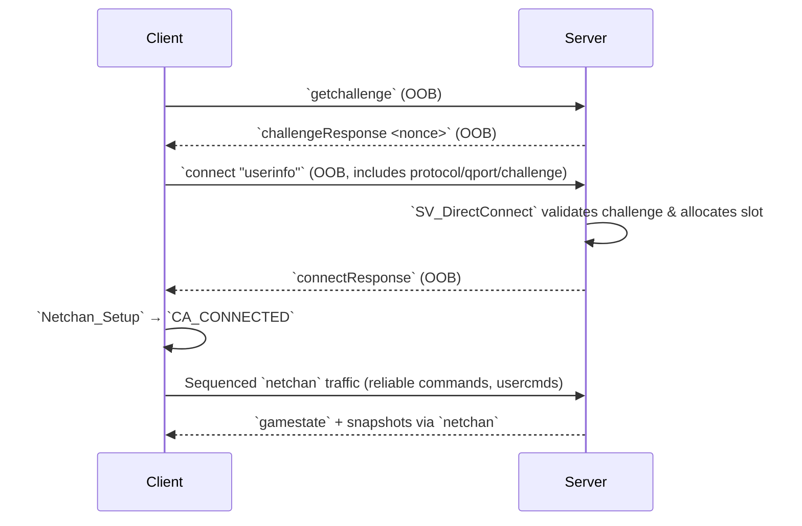

# Network Handshake Reconstruction

This document summarizes the Quake Live connection handshake, serialized packet structures, and the lightweight cryptographic routines protecting reliable traffic. Use it alongside the annotations in `src-re/annotated/net/` when instrumenting packets.

## High-level timeline

Key entry points:

- Client initiation lives in `CL_Connect_f`, which resolves the address and seeds the retransmit timers. 【F:src/code/client/cl_main.c†L1038-L1104】
- Resends and state transitions are handled by `CL_CheckForResend` and `CL_ConnectionlessPacket`. 【F:src/code/client/cl_main.c†L1489-L1836】
- Server-side challenge issuance/validation occurs inside `SV_GetChallenge` and `SV_DirectConnect`. 【F:src/code/server/sv_client.c†L134-L472】
- Once `connectResponse` is received, `Netchan_Setup` establishes sequenced communication. 【F:src/code/client/cl_main.c†L1816-L1836】

## Serialized packet layouts

### Out-of-band handshake payloads

| Message | Layout | Notes |
| --- | --- | --- |
| `getchallenge` | ASCII string | Sent periodically until a `challengeResponse` arrives. 【F:src/code/client/cl_main.c†L1489-L1526】 |
| `challengeResponse` | `"challengeResponse %i"` | Contains server nonce stored as `clc.challenge`. 【F:src/code/client/cl_main.c†L1776-L1804】 |
| `connect` | `"connect "` + quoted userinfo string | Userinfo contains `protocol`, `qport`, `challenge`, optional auth. 【F:src/code/client/cl_main.c†L1507-L1526】 |
| `connectResponse` | Headerless string | Triggers client-side `Netchan_Setup` and state change. 【F:src/code/client/cl_main.c†L1816-L1836】 |

### `netchan` packet header

All sequenced packets share a 10-byte base header described in `net_chan.c`:

| Offset | Size | Field | Description |
| --- | --- | --- | --- |
| 0 | 4 | `sequence` | Outgoing sequence, high bit set for fragments. 【F:src/code/qcommon/net_chan.c†L28-L52】【F:src/code/qcommon/net_chan.c†L304-L330】 |
| 4 | 2 | `qport` (client→server) | Mirrors client-side UDP source port for router NAT fixes. Only present on `NS_CLIENT`. 【F:src/code/qcommon/net_chan.c†L40-L69】【F:src/code/qcommon/net_chan.c†L330-L338】 |
| 6 | 2 | `fragmentStart` | Byte offset of fragment payload when `FRAGMENT_BIT` set. 【F:src/code/qcommon/net_chan.c†L320-L346】 |
| 8 | 2 | `fragmentLength` | Size of this fragment; `< FRAGMENT_SIZE` marks last fragment. 【F:src/code/qcommon/net_chan.c†L320-L347】 |

Body payload begins immediately after these fields. `Netchan_Process` uses `chan->fragmentBuffer` to reassemble multipart messages and rejects duplicates or malformed lengths. 【F:src/code/qcommon/net_chan.c†L346-L411】

## Reliable stream obfuscation

Both client and server apply symmetric XOR masking across reliable payloads. The key evolves per byte, folding in connection metadata to mitigate trivial replay attacks.

### Client decode/encode

- `CL_Netchan_Decode` reads `reliableAcknowledge`, seeds the key with `clc.challenge ^ sequence`, and iterates from `CL_DECODE_START`. Each byte XORs the key with characters from the acknowledged reliable command, resetting the index when the string terminates. 【F:src/code/client/cl_net_chan.c†L69-L112】
- `CL_Netchan_Encode` mirrors this when sending: after extracting `serverId`, `messageAcknowledge`, and `reliableAcknowledge`, the key becomes `clc.challenge ^ serverId ^ messageAcknowledge`. 【F:src/code/client/cl_net_chan.c†L25-L68】

### Server decode/encode

- `SV_Netchan_Decode` consumes the same triplet (`serverId`, `messageAcknowledge`, `reliableAcknowledge`) and derives `client->challenge ^ serverId ^ messageAcknowledge`. 【F:src/code/server/sv_net_chan.c†L60-L119】
- `SV_Netchan_Encode` seeds from `client->challenge ^ client->netchan.outgoingSequence`, ensuring each sent packet alters the mask even when acknowledgements are static. 【F:src/code/server/sv_net_chan.c†L25-L80】

Because both sides depend on the most recently acknowledged reliable command buffer, any divergence (lost command, mismatched index) scrambles subsequent data until the channel resets. The Stage 3 tracing watchlist highlights instrumentation points for capturing key evolution.

## Gamestate bootstrap

The first sequenced server message is the `gamestate` command, delivered after `connectResponse`. It embeds `clc.checksumFeed` and configstrings referenced later for command verification. 【F:src/code/client/cl_main.c†L361-L405】

Client inputs subsequently XOR `clc.checksumFeed` into the usercmd signatures during `CL_WritePacket`, binding user actions to the server-supplied seed. 【F:src/code/client/cl_input.c†L758-L768】

## Next steps

- Reuse the state transition tables under `src-re/annotated/net/` during protocol fuzzing.
- Stage 3 should capture paired client/server traces to validate the XOR stream and fragment reassembly logic described above.
